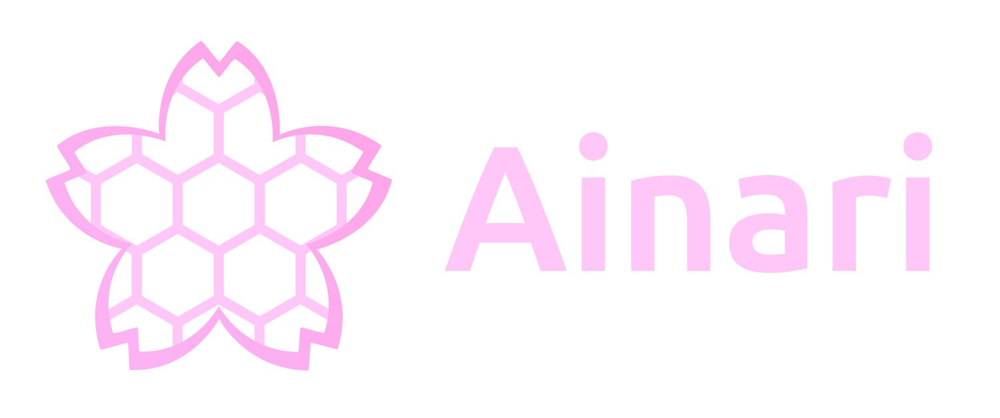

# Ainari

  

# **IMPORTANT: This project is still an experimental prototype and NOT ready for any productive usage. There is still a lot of evaluation and improvement necessary, but because this is only a spare time project beside a 40h/week job, I have only a very limited amount of time available to work on it.**

### **From version [v0.7.0](https://github.com/kitsudaiki/ainari/tree/v0.7.x) to version v0.9.0 the backend was refactored from C++ into Rust in order to improve stability and scalability.**

## Intro

Ainari contains in its core a custom experimental artificial neural network, which can work on
unnormalized and unfiltered input-data, like sensor measurement data. The network growth over time
by creating new nodes and connections between the nodes while learning new data. The original concept
was created by myself, merged with classical deep-learning and the code was written from scratch without any frameworks. The goal behind
Ainari is to create something unique, which works more like the human brain. It wasn't targeted
to get a higher accuracy than classical artificial neural networks like Tensorflow, but to be more
flexible and easier to use and more efficient in resource-consumption for big amounts of inputs and
users. Additionally it also provides an as-a-Service architecture within a cloud native environment
and multi-tenancy.

## Supported Environment

| Python-SDK                                  | Deployment                                          |
| ------------------------------------------- | --------------------------------------------------- |
| [![python-3_10][img_python-3_10]][Workflow] | [![kubernetes-1_30][img_kubernetes-1_30]][Workflow] |
| [![python-3_11][img_python-3_11]][Workflow] | [![kubernetes-1_31][img_kubernetes-1_31]][Workflow] |
| [![python-3_12][img_python-3_12]][Workflow] | [![kubernetes-1_32][img_kubernetes-1_32]][Workflow] |
|                                             | [![kubernetes-1_33][img_kubernetes-1_33]][Workflow] |

[img_python-3_10]:
    https://img.shields.io/endpoint?url=https://raw.githubusercontent.com/kitsudaiki/ainari-badges/develop/python_version/python-3_10/shields.json&style=flat-square
[img_python-3_11]:
    https://img.shields.io/endpoint?url=https://raw.githubusercontent.com/kitsudaiki/ainari-badges/develop/python_version/python-3_11/shields.json&style=flat-square
[img_python-3_12]:
    https://img.shields.io/endpoint?url=https://raw.githubusercontent.com/kitsudaiki/ainari-badges/develop/python_version/python-3_12/shields.json&style=flat-square
[img_kubernetes-1_30]:
    https://img.shields.io/endpoint?url=https://raw.githubusercontent.com/kitsudaiki/ainari-badges/develop/kubernetes_version/kubernetes-1_30/shields.json&style=flat-square
[img_kubernetes-1_31]:
    https://img.shields.io/endpoint?url=https://raw.githubusercontent.com/kitsudaiki/ainari-badges/develop/kubernetes_version/kubernetes-1_31/shields.json&style=flat-square
[img_kubernetes-1_32]:
    https://img.shields.io/endpoint?url=https://raw.githubusercontent.com/kitsudaiki/ainari-badges/develop/kubernetes_version/kubernetes-1_32/shields.json&style=flat-square
[img_kubernetes-1_33]:
    https://img.shields.io/endpoint?url=https://raw.githubusercontent.com/kitsudaiki/ainari-badges/develop/kubernetes_version/kubernetes-1_33/shields.json&style=flat-square
[Workflow]: https://github.com/kitsudaiki/ainari/actions/workflows/build_test.yml

## Current experimal and prototypically implemented features:

-   **Growing neural network**:

    The artificial neural network, which is the core of the project, growth over time while learning
    new things by creating new nodes and connections between the nodes based on the given input. A
    resize of the network is also quite linear in complexity.

-   **No normalization of input**

    The input of the network is not restricted to range of 0.0 - 1.0 . Every value can be inserted, 
    even negative values. Also if there is a single broken value in the input-data, which
    is million times higher, than the rest of the input-values, it has nearly no effect on the rest
    of the already trained data.

-   **No strict layer structure**

    The base of a new neural network is defined by a cluster-template. In these templates the
    structure of the network in planed in hexagons, indeed of layer. When a node tries to create a
    new synapse, the location of the target-node depends on the location of the source-node within
    these hexagons. The target is random and the probability depends on the distance to the source.
    This way it is possible to break the static layer structure. But when defining a line of
    hexagons and allow nodes only to connect to the nodes of the next hexagon, a classical
    layer-structure can still be enforced.

    See
    [short explanation](https://docs.ainari.cloud/inner_workings/core/core/#no-strict-layer-structure)
    and [measurement-examples](https://docs.ainari.cloud/inner_workings/measurements/measurements)

-   **Spiking neural network**

    The concept also supports a special version of working as a spiking neural network. This is
    optional for a created network and basically has the result, that an input is impacted by an
    older input, based on the time how long ago this input happened.

    See
    [short explanation](https://docs.ainari.cloud/inner_workings/core/core/#spiking-neural-network)
    and [measurement-examples](https://docs.ainari.cloud/inner_workings/measurements/measurements)

-   **3-dimensional networks**

    It is basically possible to define 3-dimensional networks. This was only added, because the
    human brain is also a 3D-object. This feature exist in the
    [cluster-templates](https://docs.ainari.cloud/frontend/cluster_templates/cluster_template/),
    but was never tested until now. Maybe in bigger tests in the future this feature could become
    useful to better mix information with each other.

## Further characteristics:

-   **Rust as programming language for the backend without unsafe**

    Even the project started with C++ as primary programming language until v0.7.0, the whole backend
    is now written in Rust without unsafe code and use `#![forbid(unsafe_code)]` to prevent the usage of 
    unsafe. Based on `cargo geiger` many used dependencies sadly still use much unsafe code,
    but at least in this repository here no unsafe code is added. 

-   **Parallelism**

    The processing structure works also for multiple threads, which can work at the same time on the
    same network. (GPU-support with CUDA is disabled at the moment for various reasons).

-   **Generated OpenAPI-Documentation**

    The OpenAPI-documentation is generated directly from the code. So changing the settings of a
    single endpoint in the code automatically results in changes of the resulting documentation, to
    make sure, that code and documentation are in sync.

    See [OpenAPI-docu](https://docs.ainari.cloud/frontend/rest_api_documentation/)

-   **Multi-user and multi-project**

    The projects supports multiple user and multiple projects with different roles (member,
    project-admin and admin) and also managing the access to single api-endpoints via policy-file.
    Each user can login by username and passphrase and gets an JWT-token to access the user- and
    project-specific resources.

    See [Authorization-docu](https://docs.ainari.cloud/inner_workings/user_and_projects/)

-   **Efficient resource-usage**

    1. The concept of the neural network results in the effect, that only necessary synapses of an
       active node of the network is processed, based on the input. So if only very few input-nodes
       get data pushed in, there is less processing-time necessary to process the network.

    2. Because of the multi-user support, multiple networks of multiple users can be processed on
       the same physical host and share the RAM, CPU-cores and even the GPU, without splitting them
       via virtual machines or vCPUs.

    3. Capability to regulate the cpu-frequencey and measure power-consumption. (disabled currently)

        See
        [Monitoring-docu](https://docs.ainari.cloud/inner_workings/monitoring/monitoring/#controlling-cpu-frequency)

-   **Network-input**

    Interaction with the network by direct synchronous single requests or with asynchronous task in a 
    task-queue.

-   **Installation on Kubernetes**

    The backend can be basically deployed on kubernetes via Helm-chart.

    See [Installation-docu](https://docs.ainari.cloud/backend/installation/)

## Known disadvantages

The concept is not perfect and also has some disadvantages, which are the result of the architecture
itself:

-   A single synapse needs more memory than in a classical network. The hope is, in bigger tests, it
    becomes much more efficient compared to fully meshed layered networks.

## Getting started

-   [Example-Workflow](https://docs.ainari.cloud/frontend/example_workflow/)

-   [Installation-Guide](https://docs.ainari.cloud/backend/installation/)

-   [SDK and CLI documentation](https://docs.ainari.cloud/frontend/cli_sdk_docu/)

-   [Automatic generated OpenAPI documentation](https://docs.ainari.cloud/frontend/rest_api_documentation/)

## Development

-   [How to build](https://docs.ainari.cloud/repo/build_guide/)

-   [Development-Guide](https://docs.ainari.cloud/repo/development/)

-   [Contributing guide](https://github.com/kitsudaiki/ainari/blob/develop/CONTRIBUTING.md)

-   [Dependency-Overview](https://docs.ainari.cloud/repo/dependencies/)

## Pre-build objects

All objects are automatically build and uploaded by the
[CI-pipeline](https://github.com/kitsudaiki/ainari/actions/workflows/build_test.yml) for each merge
on `develop`-branch and for each tag.

-   [Docker-images](https://hub.docker.com/repository/docker/kitsudaiki/hanami/tags)

-   [client, SDK and helm-chart](https://files.ainari.cloud/)

## Currently disabled features

There are some features, which existed in the past, were disabled temporary and will be
added/enabled again in the near future:

1. Dashboard

    As a PoC a first dashboard was created, without any framework. It is planned to refactor this
    old version in `v0.9.0` and re-write it again with Typescript and some additional frameworks.
    Until then, it is temporary disabled, because it would current cost too much time to keep this
    unused and prototypical version up-to-data. As reference see the example-workflow of the
    PoC-dashboard: [Dashboard-docu](https://docs.ainari.cloud/frontend/dashboard/dashboard/)

2. Regulation of CPU-speed

    Also in older version there also was the function available to regulate the speed of the CPU
    based on the workload. The dashboard was used to visualize the CPU metrics like the speed. Since
    the dashboard was disabled, there is at the moment not feedback available, so for usability
    reasons the feature was not further maintained and disabled for now.

3. GPU-support

    There already were some attempts in the past to add GPU-support with CUDA and OpenCL in the
    past. Some version like 0.4.0 also had a working version implemented. The problem was
    disappointing performance and some restrictions for the CPU-version too. There will be some
    further attempts in the future, to fix this issue and bring GPU support back into the project,
    but because there is no definite solution now, it is unknown when this happens.

4. Role-based policies

    Until 0.7.0 there were policies and roles, which were removed for the moment, because they were
    not translated into the new Rust code so far. 

## Roadmap

see [Roadmap](https://github.com/kitsudaiki/ainari/blob/develop/ROADMAP.md)

## Author

**Tobias Anker**

eMail: tobias.anker@kitsunemimi.moe

## License

The complete project is under
[Apache 2 license](https://github.com/kitsudaiki/ainari/blob/develop/LICENSE).
