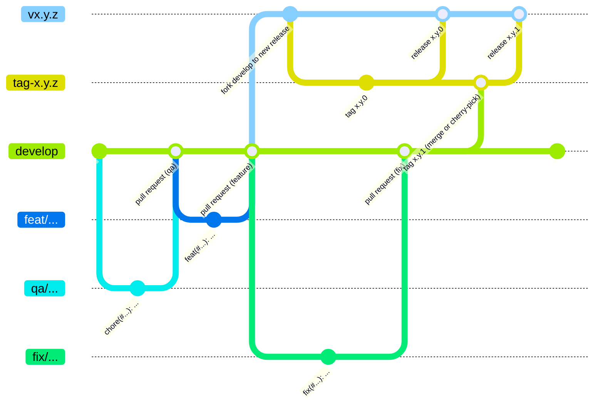

# Git-Workflow

## Basic git workflow



## Branches

### `develop`

- main-branch
- doesn't allow direct commits. Everything has to be added by pull requests.

### `tag-x.y.z`

- tag-branch
- for example: `tag-0.3.1`
- used for tagging new versions

### `vx.y.z`

- contains all realeases of a specific minor version
- for example: `v0.3.x` and contains versions `v0.3.0`, `v0.3.1` and so on

### `fix/...`

- bug-fix branches
- created for fixing bug-report issues
- for example: `fix/fix-creashes-in-api`

### `feat/...`

- features branches
- for new features or improvement of features
- created for feature issues
- for example: `feature/add-cuda-support`

### `qa/...`

- quality assurance branches
- for everything else: typo fixes, updating comments, fixes in documentation, updates at the
    ci-pipeline, and so on
- created for qa issues
- for example: `qa/reduce-storage-consumption-of-ci-pipeline`

## Commits

### Keywords

All the standard keywords:

- `build`
- `chore`
- `ci`
- `docs`
- `feat`
- `fix`
- `perf`
- `refactor`
- `revert`
- `style`
- `test`

### Commit-Message

All commit-messages have to match the following pattern:

```text
<KEYWORD> (#<ISSUE_NUMBER>): <SHORT_DESCRIPTION>

<LONG DESCRIPTION>
```

!!! example

    ```
    Fix (#168): removed old checkpoint endpoints

    The endpoints to create and finalize checkpoints
    were deprecated since removing the microservice-
    architecture. They were also not used interenally
    anymore. So they were removed from the code.
    ```
