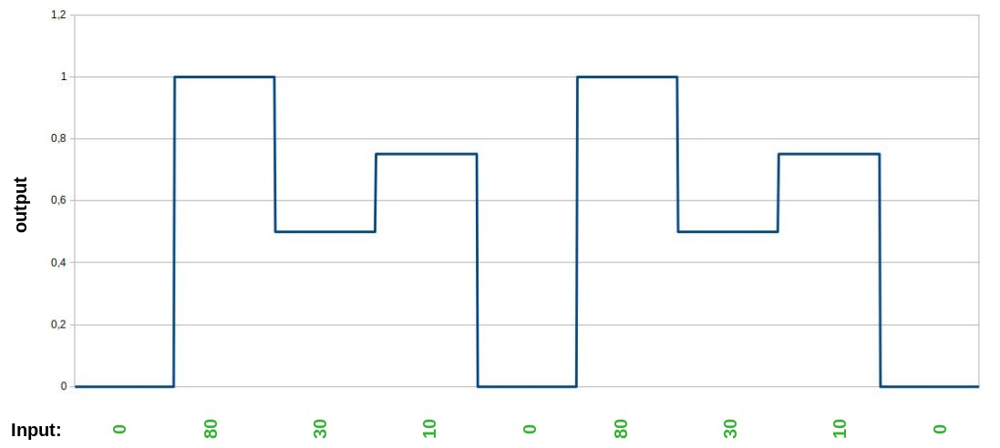
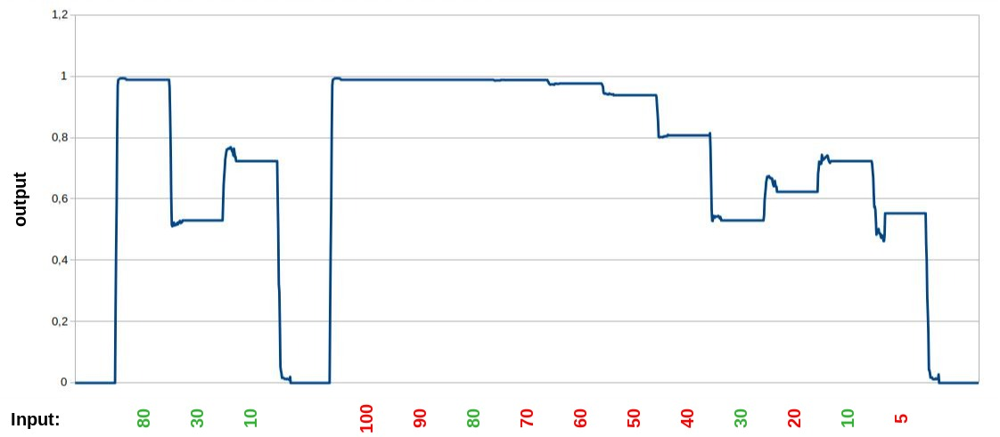
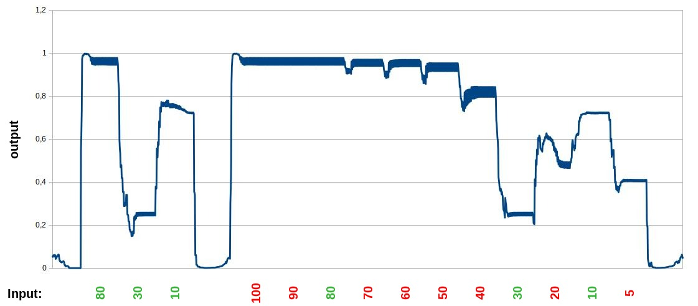
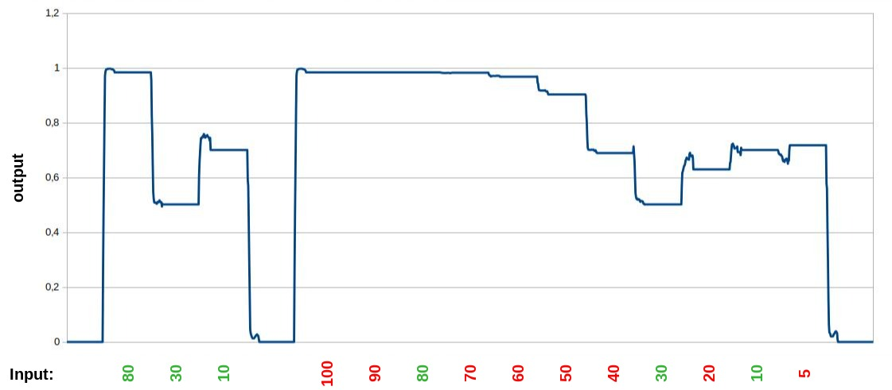
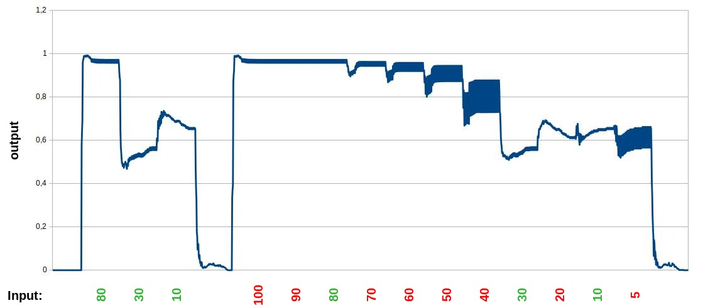

# Optional features and Measurements

!!! info

    The following tests were made with version 0.4.0 and not repeated with newer versions so far, even
    the cluster-templates of the examples were updated here. So the results can differ in there current
    state. Test tests here will be repeated in the near future.

These are some measurements, which were done with the program on version 0.4.0, to get a basic
overview of the capabilities and limitations so far.

## Test with table

#### Data-input

The test-data were a CSV-file with one column for input and one for output with

- 100 times input 0 and desired output 0.0
- 100 times input 80 and desired output 1.0
- 100 times input 30 and desired output 0.5
- 100 times input 10 and desired output 0.75
- 100 times input 0 and desired output 0.0

Graphical the desired function to learn looks like this:



This is a very constructed scenario, so it is may be not the optimal case for testing the features.

#### Cluster-template

To define the cluster the following cluster-template was used:

```
version: 1
settings:
    neuron_cooldown: 100000000000.0
    refractory_time: 1
    max_connection_distance: 1

hexagons:
    1,1,1
    2,1,1
    3,1,1
    4,1,1

inputs:
    test_input: 1,1,1

outputs:
    test_output: 4,1,1
```

#### Data-processing

Training on a CSV-file at the moment looks like this:

```
...
[ 0, 0, 0, 0, 0, 0, 0, 0, 0, 0, 0, 0, 0, 0, 0, 0, 0, 0, 0, 0, 0, 0, 0, 0, 0 ]
[ 0, 0, 0, 0, 0, 0, 0, 0, 0, 0, 0, 0, 0, 0, 0, 0, 0, 0, 0, 0, 0, 0, 0, 0, 0 ]
[ 0, 0, 0, 0, 0, 0, 0, 0, 0, 0, 0, 0, 0, 0, 0, 0, 0, 0, 0, 0, 0, 0, 0, 0, 0 ]
[ 0, 0, 0, 0, 0, 0, 0, 0, 0, 0, 0, 0, 0, 0, 0, 0, 0, 0, 0, 0, 0, 0, 0, 0, 0 ]
[ 0, 0, 0, 0, 0, 0, 0, 0, 0, 0, 0, 0, 0, 0, 0, 0, 0, 0, 0, 0, 0, 0, 0, 0, 80 ]
[ 0, 0, 0, 0, 0, 0, 0, 0, 0, 0, 0, 0, 0, 0, 0, 0, 0, 0, 0, 0, 0, 0, 0, 80, 80 ]
[ 0, 0, 0, 0, 0, 0, 0, 0, 0, 0, 0, 0, 0, 0, 0, 0, 0, 0, 0, 0, 0, 0, 80, 80, 80 ]
[ 0, 0, 0, 0, 0, 0, 0, 0, 0, 0, 0, 0, 0, 0, 0, 0, 0, 0, 0, 0, 0, 80, 80, 80, 80 ]
[ 0, 0, 0, 0, 0, 0, 0, 0, 0, 0, 0, 0, 0, 0, 0, 0, 0, 0, 0, 0, 80, 80, 80, 80, 80 ]
[ 0, 0, 0, 0, 0, 0, 0, 0, 0, 0, 0, 0, 0, 0, 0, 0, 0, 0, 0, 80, 80, 80, 80, 80, 80 ]
[ 0, 0, 0, 0, 0, 0, 0, 0, 0, 0, 0, 0, 0, 0, 0, 0, 0, 0, 80, 80, 80, 80, 80, 80, 80 ]
[ 0, 0, 0, 0, 0, 0, 0, 0, 0, 0, 0, 0, 0, 0, 0, 0, 0, 80, 80, 80, 80, 80, 80, 80, 80 ]
[ 0, 0, 0, 0, 0, 0, 0, 0, 0, 0, 0, 0, 0, 0, 0, 0, 80, 80, 80, 80, 80, 80, 80, 80, 80 ]
[ 0, 0, 0, 0, 0, 0, 0, 0, 0, 0, 0, 0, 0, 0, 0, 80, 80, 80, 80, 80, 80, 80, 80, 80, 80 ]
[ 0, 0, 0, 0, 0, 0, 0, 0, 0, 0, 0, 0, 0, 0, 80, 80, 80, 80, 80, 80, 80, 80, 80, 80, 80 ]
[ 0, 0, 0, 0, 0, 0, 0, 0, 0, 0, 0, 0, 0, 80, 80, 80, 80, 80, 80, 80, 80, 80, 80, 80, 80 ]
[ 0, 0, 0, 0, 0, 0, 0, 0, 0, 0, 0, 0, 80, 80, 80, 80, 80, 80, 80, 80, 80, 80, 80, 80, 80 ]
[ 0, 0, 0, 0, 0, 0, 0, 0, 0, 0, 0, 80, 80, 80, 80, 80, 80, 80, 80, 80, 80, 80, 80, 80, 80 ]
[ 0, 0, 0, 0, 0, 0, 0, 0, 0, 0, 80, 80, 80, 80, 80, 80, 80, 80, 80, 80, 80, 80, 80, 80, 80 ]
[ 0, 0, 0, 0, 0, 0, 0, 0, 0, 80, 80, 80, 80, 80, 80, 80, 80, 80, 80, 80, 80, 80, 80, 80, 80 ]
[ 0, 0, 0, 0, 0, 0, 0, 0, 80, 80, 80, 80, 80, 80, 80, 80, 80, 80, 80, 80, 80, 80, 80, 80, 80 ]
[ 0, 0, 0, 0, 0, 0, 0, 80, 80, 80, 80, 80, 80, 80, 80, 80, 80, 80, 80, 80, 80, 80, 80, 80, 80 ]
[ 0, 0, 0, 0, 0, 0, 80, 80, 80, 80, 80, 80, 80, 80, 80, 80, 80, 80, 80, 80, 80, 80, 80, 80, 80 ]
[ 0, 0, 0, 0, 0, 80, 80, 80, 80, 80, 80, 80, 80, 80, 80, 80, 80, 80, 80, 80, 80, 80, 80, 80, 80 ]
[ 0, 0, 0, 0, 80, 80, 80, 80, 80, 80, 80, 80, 80, 80, 80, 80, 80, 80, 80, 80, 80, 80, 80, 80, 80 ]
[ 0, 0, 0, 80, 80, 80, 80, 80, 80, 80, 80, 80, 80, 80, 80, 80, 80, 80, 80, 80, 80, 80, 80, 80, 80 ]
[ 0, 0, 80, 80, 80, 80, 80, 80, 80, 80, 80, 80, 80, 80, 80, 80, 80, 80, 80, 80, 80, 80, 80, 80, 80 ]
[ 0, 80, 80, 80, 80, 80, 80, 80, 80, 80, 80, 80, 80, 80, 80, 80, 80, 80, 80, 80, 80, 80, 80, 80, 80 ]
[ 80, 80, 80, 80, 80, 80, 80, 80, 80, 80, 80, 80, 80, 80, 80, 80, 80, 80, 80, 80, 80, 80, 80, 80, 80 ]
[ 80, 80, 80, 80, 80, 80, 80, 80, 80, 80, 80, 80, 80, 80, 80, 80, 80, 80, 80, 80, 80, 80, 80, 80, 80 ]
[ 80, 80, 80, 80, 80, 80, 80, 80, 80, 80, 80, 80, 80, 80, 80, 80, 80, 80, 80, 80, 80, 80, 80, 80, 80 ]
[ 80, 80, 80, 80, 80, 80, 80, 80, 80, 80, 80, 80, 80, 80, 80, 80, 80, 80, 80, 80, 80, 80, 80, 80, 80 ]
[ 80, 80, 80, 80, 80, 80, 80, 80, 80, 80, 80, 80, 80, 80, 80, 80, 80, 80, 80, 80, 80, 80, 80, 80, 80 ]
...
```

It maps the inputs of the input-hexagon on the beginning of the given data and with each cycle it
moves one forward. For the output to train it is the same.

### Results

The following shows the results with different options. On the left side the output is shown for the
same input, while training. On the right side of the diagrams there are the real test-values. Green
are the values, which were also in the training-dataset and red are the unknow inputs with the
output, coming from the neural network for these inputs. All diagrams are showing the average of 10
measurements.

#### Normal

In this case, only the default-values of the settings-block were used.



The left part for the trained inputs are showing nearly the exact output, like trained. The right
side shows a really good interpolation for unknown (red) input-values. Even the `100`, which is
above the trained maximum, doesn't break the result and the cluster handle the value, like the
maximum, which it has learned while training.

#### With different settings

Used were the [settings-options](/frontend/cluster_templates/cluster_template/#settings) within the
cluster-template to modify the behavior of the cluster.

- **Modified neuron-cooldown and refractory-time**

    ```
    settings:
       neuron_cooldown: 1.5
       refractory_time: 5
    ```

    

- **Modified connection-distance**

    ```
    settings:
       max_connection_distance: 2
    ```

    

- **Modified neuron-cooldown, refractory-time and connection-distance**

    ```
    settings:
       neuron_cooldown: 1.5
       refractory_time: 5
       max_connection_distance: 2
    ```

    

The output is still similar, like in the normal version, so it doesn't break the result, but the
output is not better compared to the normal version. The thicker lines showing the the places, where
the output spikes and switch between two values. Maybe this example here is too small and/or too
artificial constructed to bring some advantages, but it is interesting to see, that in the unknown
interpolated sections the spikes are much bigger.

!!! info

    These examples will be updated, when a more optimal test-case was found. It is only the current
    state of evaluation.
