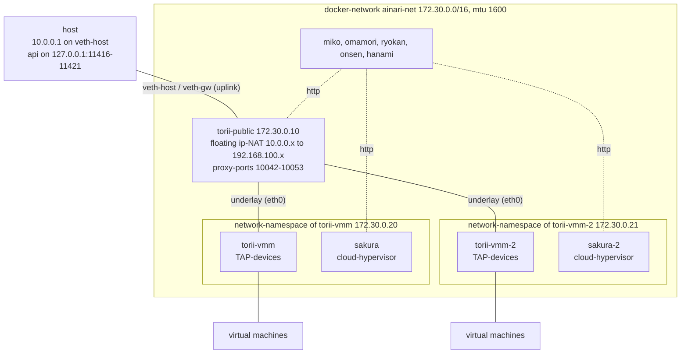

# Docker-compose setup

## Overview

Runs every component of ainari as a docker-container on the host, defined in `docker-compose.yml`.
There is one gateway at the edge of the network (`torii-public`), which serves the floating
ip-addresses towards the host, and one gateway in front of every sakura-host (`torii-vmm`,
`torii-vmm-2`), which owns the TAP-devices of the virtual machines of that host. There are two
sakura-hosts, so a virtual machine can land on either of them and the traffic between the hosts
really crosses the edge-gateway. The components talk plain http to each other.

## Architecture



Beside the gateways and the sakura-hosts the setup runs `miko` (auth), `omamori` (secrets and
public-keys), `ryokan` (images) with `onsen` (storage) and `hanami` (the api for the virtual
machines). There is no dashboard.

A sakura has no network of its own, because it shares the network-namespace of its gateway. Its
address `http://sakura:11420` (and `http://sakura-2:11420`) is an alias of its gateway in the dns
of docker: the host is listed under its own name, while the address still leads to the
network-namespace, which it shares, and hanami derives the torii of a host from it again.

Hanami picks one of the sakura-hosts for every new virtual machine. Both hosts serve addresses
out of the same subnet of a network: the edge-gateway gets a route towards the host, which really
runs a virtual machine, and the gateway of a host sends everything else to the edge-gateway, so
two virtual machines on different hosts reach each other over it.

## Requirements

- docker with the compose-plugin (`docker compose`)
- `/dev/kvm` and `/dev/net/tun` on the host, because the virtual machines are really booted
- a kernel with eBPF/XDP support, because the gateways attach their datapath to the interfaces
- `sudo`, because the setup-script connects the host to the edge-gateway and adds NAT-rules
- `make`
- `go` in the version of `src/cli/ainarictl/go.mod`, to build the cli
- `python3` with the dependencies of the sdk for the end-to-end test:

    ```bash
    python3 -m venv .venv
    .venv/bin/pip install -r src/sdk/python/ainari_sdk/requirements.txt
    ```

## Usage

1. start the stack. It builds the images first. It needs root, because it creates the veth-pair
   towards the edge-gateway and the NAT-rules for the floating ip-addresses. `docker compose up`
   alone is not enough: `torii-public` waits for that uplink and the host has no route to a
   virtual machine without it.

    ```bash
    make up local    # runs: sudo ./scripts/setup_local_stack.sh
    ```

2. build the cli. The binary is placed beside its sources.

    ```bash
    cd src/cli/ainarictl && go build .
    ```

3. point the cli at the stack and check, that both sakura-hosts are registered. They are listed
   as `http://sakura:11420` and `http://sakura-2:11420`.

    ```bash
    source src/cli/ainarictl/test_auth.sh    # AINARI_ADDRESS, AINARI_USER, AINARI_PASSPHRASE
    ainarictl host list
    ```

4. create a virtual machine. `-j` prints json, so the uuids can be read with `jq`.

    ```bash
    ssh-keygen -t ed25519 -N '' -f ~/.ssh/ainari_local
    ainarictl public_key upload -k ~/.ssh/ainari_local.pub local-key

    wget https://cloud-images.ubuntu.com/noble/current/noble-server-cloudimg-amd64.img
    ainarictl image create disk -i noble-server-cloudimg-amd64.img ubuntu-noble

    ainarictl network create -s 192.168.100.1/24 local-net
    ainarictl vm create -c 2 -m 2048 -d 10 -u NETWORK_UUID -i IMAGE_UUID -k KEY_UUID vm1
    ainarictl vm get VM_UUID                 # repeat, until 'vm_state' is RUNNING
    ainarictl floating_ip add -n vm1-fip -v VM_UUID   # or: floating_ip add + floating_ip attach FIP_UUID VM_UUID
    ```

5. connect to the virtual machine over its floating ip-address, which the host reaches over
   `veth-host`.

    ```bash
    ssh -i ~/.ssh/ainari_local ubuntu@FLOATING_IP
    ```

   The sakura-host, which got the virtual machine, is reachable at `http://127.0.0.1:TORII_PORT`
   with the proxy-port from the output of `vm create`. Its api requires a token, so `ainarictl`
   is the easier way to ask it.

6. stop the stack again. This also removes the veth-pair and throws all data away.

    ```bash
    make down local    # runs: sudo ./scripts/setup_local_stack.sh --down
    ```

The api is reachable on the host at:

| Component | Address                  |
| --------- | ------------------------ |
| miko      | `http://127.0.0.1:11417` |
| hanami    | `http://127.0.0.1:11418` |
| ryokan    | `http://127.0.0.1:11416` |
| omamori   | `http://127.0.0.1:11421` |
| torii     | `http://127.0.0.1:11419` |

The admin-user is `asdf` with the passphrase `asdfasdf`; both can be overwritten with
`AINARI_USER` and `AINARI_PASSPHRASE` before the setup-script is started.

## End-to-end test

`testing/local_stack/vm_lifecycle_test.py` walks through the whole life-cycle with the python-sdk,
from the ssh-key-pair up to the login into the virtual machines over ssh. It creates two virtual
machines out of the same image, with the same public key and within the same network, and gives
every one of them its own floating ip-address.

```bash
make up local
.venv/bin/python testing/local_stack/vm_lifecycle_test.py
make down local
```

The test waits at its start until both sakura-hosts are registered in hanami.
`AINARI_SAKURA_HOSTS` sets how many hosts it waits for and `AINARI_VIRTUAL_MACHINES` how many
virtual machines it creates. Every one of them gets 2 cores and 2 GiB memory, so the two of the
default need 4 GiB on the host.

## Running from the tools-container

The image `dockerfiles/Dockerfile_local_test_tools` contains all tools of the requirements above,
which can be installed in an image, so they don't have to be installed on the host. The container
runs in the network- and pid-namespace of the host and uses the docker of the host, so the setup
is deployed on the host, exactly like without the container. The repository is mounted with the
same path as on the host, because the docker of the host resolves the paths of the setup.
`HOST_UID` and `HOST_GID` let the container run as the user of the host, so the files, which the
setup creates in the repository, belong to this user; the user has sudo within the container.

Build the image once in the root of the repository:

```bash
docker build -f dockerfiles/Dockerfile_local_test_tools -t ainari/local-test-tools .
```

Start the container in the root of the repository:

```bash
docker run --rm -it --privileged --network host --pid host \
    -e HOST_UID=$(id -u) -e HOST_GID=$(id -g) \
    -v /var/run/docker.sock:/var/run/docker.sock \
    -v "$PWD:$PWD" -w "$PWD" \
    ainari/local-test-tools
```

Within the container, the setup is started, tested and stopped with the same commands as on the
host. The python of the container has the dependencies of the sdk already:

```bash
make up local
python3 testing/local_stack/vm_lifecycle_test.py
cd src/cli/ainarictl && go build . && cd -    # the cli, if needed
make down local
```

What still has to be on the host: docker, `/dev/kvm`, `/dev/net/tun` and a kernel with
eBPF/XDP-support. The setup is reachable from the host like without the container: the api at
`http://127.0.0.1:11417` and the floating ip-addresses over `veth-host`, which the setup-script
creates on the host. The setup keeps running, when the container is left; it is stopped with
`make down local` out of a new container.

## Hints

- **What the setup-script does as root:** it starts the containers with `docker compose`, creates
  the veth-pair `veth-host` / `veth-gw`, gives the host side the address `10.0.0.1/24` and the
  gateway side `10.0.0.254/24`, moves the gateway side into the network-namespace of
  `torii-public`, enables `net.ipv4.ip_forward` and adds a MASQUERADE-rule for `10.0.0.0/24`, so
  the virtual machines reach the internet through the host. The host only ever sees the floating
  ip-addresses; the internal addresses of the virtual machines (`192.168.100.0/24`) stay behind
  the gateway.
- **Privileges:** the three gateways run privileged, because they attach their eBPF-programs to
  the interfaces and create the TAP-devices. The sakura-hosts run as the user `ainari`: the
  hypervisor-binary carries `cap_net_admin+ep` as a file-capability and the containers get
  `CAP_NET_ADMIN` over `cap_add`. `/dev/kvm` is opened through its group, whose id the
  setup-script reads from the device and hands to the containers with `group_add`.
- **State:** every run starts with empty databases; the databases and boot-disks live in the
  containers.
- **Configs:** the configs of the components are in `testing/local_stack/configs`. The two gateways
  in front of the sakura-hosts share `torii_vmm.toml`; the sakura-hosts need one config each
  (`sakura.toml`, `sakura_2.toml`), because every host registers itself with the address out of
  its own config.
- **Conflicts:** the setup-script refuses to start, if another interface of the host has an
  address in `10.0.0.0/24`, for example the one of the kind-setup. Stop the other setup first.
