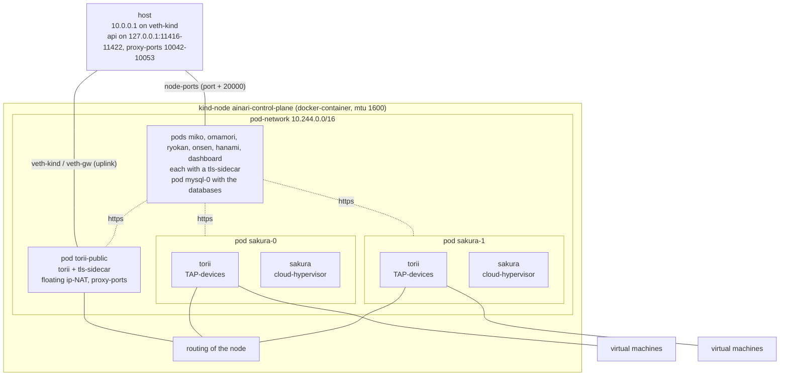

# Kind setup

## Overview

Runs the helm-chart of `deploy/k8s/ainari` on a kubernetes-cluster of one node, which kind
(kubernetes in docker) runs as a docker-container on the host. The values
`deploy/k8s/kind/values.yaml` configure the chart for it. There is one gateway at the edge of the
network (`torii-public`), which serves the floating ip-addresses towards the host, and two
sakura-hosts, each one a pod of the statefulset `sakura` together with the gateway in front of it.
The components only talk https to each other, over a nginx-sidecar with a certificate of
cert-manager. The dashboard is always part of this setup.

## Architecture



The pod-network of kind is routed: every pod has a point-to-point link to the node. The gateways
don't share a link, so torii addresses its encapsulated packets to the router of the node, which
it takes from the route of the kernel, and the node forwards them to the other pod.

Every sakura-host registers itself with the name of its pod in the headless service `sakura`
(`https://sakura-0.sakura.ainari.svc.cluster.local:8443`). Its torii shares the pod, so hanami
derives the torii of a host from this address.

## Requirements

- docker (the engine), which builds the images and runs the kind-node
- `kind`. If it is not installed, `make` downloads the version of `KIND_VERSION` in the
  `Makefile` with `curl` into `temporary_files/bin`.
- `kubectl` and `helm`
- `openssl`, to create the CA of the setup
- `/dev/kvm` and `/dev/net/tun` on the host, because the virtual machines are really booted
- a kernel with eBPF/XDP support, because the gateways attach their datapath to the interfaces
- `sudo`, because the setup-script connects the host to the edge-gateway and adds NAT-rules
- access to github, because cert-manager is installed into the cluster from there
- `make`
- `go` in the version of `src/cli/ainarictl/go.mod`, to build the cli
- `python3` with the dependencies of the sdk for the end-to-end test:

    ```bash
    python3 -m venv .venv
    .venv/bin/pip install -r src/sdk/python/ainari_sdk/requirements.txt
    ```

Docker compose is not required.

## Usage

```bash
make up kind      # runs scripts/setup_kind_stack.sh, asks for sudo for the network-setup
make down kind    # deletes the cluster and removes the veth-pair again
```

`make up kind` builds the images, creates the cluster (`deploy/k8s/kind/cluster.yaml`), installs
cert-manager and the helm-chart and connects the host to the edge-gateway. Miko, hanami, ryokan
and omamori store their data in the mysql-server `mysql-0`, which the chart deploys into the
cluster. Every run starts with empty databases.

The api is reachable on the host at:

| Component | Address                   |
| --------- | ------------------------- |
| miko      | `https://127.0.0.1:11417` |
| hanami    | `https://127.0.0.1:11418` |
| ryokan    | `https://127.0.0.1:11416` |
| omamori   | `https://127.0.0.1:11421` |
| dashboard | `https://127.0.0.1:11422` |

The api of torii is only reachable within the cluster. The virtual machines and their sakura-hosts
are reached over the proxy-ports of torii (`127.0.0.1:<proxy-port>`), and the proxies can be listed
over hanami (`GET /v1alpha/proxy`).

The admin-user is `asdf` with the passphrase `asdfasdf`.

Build the cli in `src/cli/ainarictl` with `go build .` and point it at miko. Without the CA of the
setup in the trust-store of the system (see
[The CA of the kind- and the vagrant-setup](https_ca.md)), the cli has to skip the verification of
the certificates:

```bash
export AINARI_ADDRESS=https://127.0.0.1:11417 AINARI_USER=asdf AINARI_PASSPHRASE=asdfasdf
ainarictl --insecure host list
```

A virtual machine is created like this:

```bash
ssh-keygen -t ed25519 -N '' -f ~/.ssh/ainari_local
ainarictl --insecure public_key upload -k ~/.ssh/ainari_local.pub local-key

wget https://cloud-images.ubuntu.com/noble/current/noble-server-cloudimg-amd64.img
ainarictl --insecure image create disk -i noble-server-cloudimg-amd64.img ubuntu-noble

ainarictl --insecure network create -s 192.168.100.1/24 local-net
ainarictl --insecure vm create -c 2 -m 2048 -d 10 -u NETWORK_UUID -i IMAGE_UUID -k KEY_UUID vm1
ainarictl --insecure vm get VM_UUID      # repeat, until 'vm_state' is RUNNING
ainarictl --insecure floating_ip add -n vm1-fip -v VM_UUID   # or: floating_ip add + floating_ip attach FIP_UUID VM_UUID

ssh -i ~/.ssh/ainari_local ubuntu@FLOATING_IP
```

The cluster can be inspected with:

```bash
kubectl --context kind-ainari --namespace ainari get pods
```

## End-to-end test

`testing/ainari_test/vm_lifecycle_test.py` walks through the whole life-cycle with the python-sdk,
from the ssh-key-pair up to the login into the virtual machines over ssh. It skips the
verification of the certificates.

```bash
make up kind
AINARI_MIKO_ADDRESS=https://127.0.0.1:11417 .venv/bin/python testing/ainari_test/vm_lifecycle_test.py
make down kind
```

`AINARI_SAKURA_HOSTS` sets how many sakura-hosts the test waits for (default 2) and
`AINARI_VIRTUAL_MACHINES` how many virtual machines it creates (default 2, each with 2 cores and
2 GiB memory).

## Running from the tools-container

The image `dockerfiles/Dockerfile_local_test_tools` contains all tools of the requirements above,
which can be installed in an image, so they don't have to be installed on the host. The container
runs in the network- and pid-namespace of the host and uses the docker of the host, so the setup
is deployed on the host, exactly like without the container. The repository is mounted with the
same path as on the host, because the docker of the host resolves the paths of the setup.
`HOST_UID` and `HOST_GID` let the container run as the user of the host, so the files, which the
setup creates in the repository, belong to this user; the user has sudo within the container.

Build the image once in the root of the repository:

```bash
docker build -f dockerfiles/Dockerfile_local_test_tools -t ainari/local-test-tools .
```

Start the container in the root of the repository. `KUBECONFIG` puts the kubeconfig of the
cluster into the repository, so it is still there after the container is left:

```bash
docker run --rm -it --privileged --network host --pid host \
    -e HOST_UID=$(id -u) -e HOST_GID=$(id -g) \
    -e KUBECONFIG="$PWD/temporary_files/kind/kubeconfig" \
    -v /var/run/docker.sock:/var/run/docker.sock \
    -v "$PWD:$PWD" -w "$PWD" \
    ainari/local-test-tools
```

Within the container, the setup is started, tested and stopped with the same commands as on the
host. The python of the container has the dependencies of the sdk already, and `kubectl` and
`kind` are available:

```bash
make up kind
AINARI_MIKO_ADDRESS=https://127.0.0.1:11417 python3 testing/ainari_test/vm_lifecycle_test.py
kubectl --namespace ainari get pods
make down kind
```

What still has to be on the host: docker, `/dev/kvm`, `/dev/net/tun` and a kernel with
eBPF/XDP-support. The setup is reachable from the host like without the container: the api and
the dashboard at `https://127.0.0.1:<port>`, the floating ip-addresses over `veth-kind`, which
the setup-script creates on the host, and the cluster with
`kubectl --kubeconfig temporary_files/kind/kubeconfig`, if `kubectl` is installed on the host.
The setup keeps running, when the container is left; it is stopped with `make down kind` out of a
new container, started with the same command.

## Hints

- **Certificates:** all certificates are signed by the CA `temporary_files/kind/ainari-kind-ca.crt`.
  Without it in the trust-stores, the clients have to skip the verification and the dashboard
  can't log in. How to trust it is described in
  [The CA of the kind- and the vagrant-setup](https_ca.md).
- **What the setup-script does as root:** it creates the veth-pair `veth-kind` / `veth-gw`, gives
  the host side `10.0.0.1/24`, moves the gateway side over the network-namespace of the node into
  the one of the pod `torii-public`, enables `net.ipv4.ip_forward` and adds a MASQUERADE-rule for
  `10.0.0.0/24`.
- **Ports:** the api and the proxy-ports are published as node-ports (port + 20000, see
  `global.external_services` in the values) and mapped back to their original ports on
  `127.0.0.1` by the `extraPortMappings` of `deploy/k8s/kind/cluster.yaml`.
- **kvm:** the kind-node creates its own `/dev/kvm`, so sakura gets the kvm-group of the node, not
  the one of the host. The setup-script reads it from the node.
- **grpc:** the connection between ryokan, sakura and onsen is still plain grpc, because the
  grpc-client has no tls-support yet.
- **Conflicts:** the setup-script refuses to start, if another interface of the host has an
  address in `10.0.0.0/24`, for example the one of the docker-compose setup. Stop the other setup
  first.
