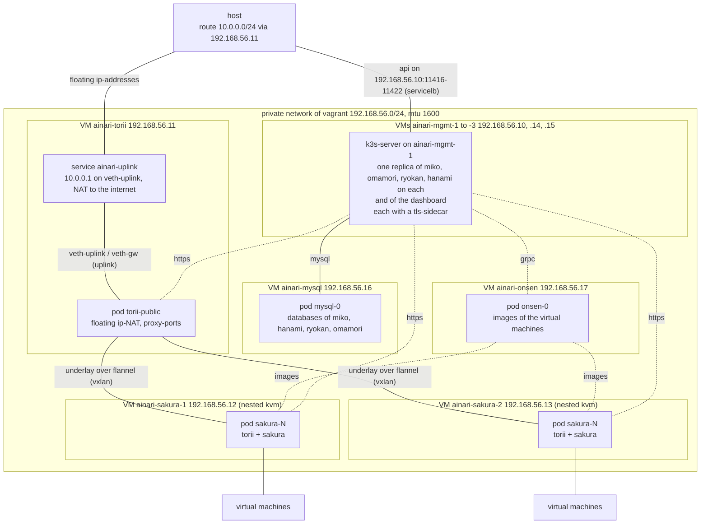

# Vagrant setup

## Overview

Runs the helm-chart of `deploy/k8s/ainari` on a kubernetes-cluster (k3s) of eight virtual machines,
which vagrant creates with libvirt (`testing/vagrant/Vagrantfile`). An ansible-playbook
(`testing/vagrant/playbook.yaml`) installs k3s, cert-manager and the chart with the values of
`testing/vagrant/values.yaml`. Every component runs only on the virtual machines with its label,
so the traffic between the sakura-hosts and the edge-gateway really crosses the network between
the virtual machines. The sakura-hosts get nested virtualization, so they boot the virtual
machines of ainari within their own virtual machine. The components only talk https to each
other, over a nginx-sidecar with a certificate of cert-manager. The dashboard is always part of
this setup.

Miko, hanami, ryokan and omamori run with three replicas, one on each of the three
management-machines, and all of them share the mysql-server on the virtual machine `ainari-mysql`.
So the setup also tests, that the control-components work with multiple replicas: a request can
land on any of them, because they keep their state only within the database.

| Virtual machine   | Address         | Runs                                                                        |
| ----------------- | --------------- | --------------------------------------------------------------------------- |
| `ainari-mgmt-1`   | `192.168.56.10` | the k3s-server, one replica of miko, hanami, ryokan and omamori             |
| `ainari-mgmt-2`   | `192.168.56.14` | one replica of miko, hanami, ryokan and omamori                             |
| `ainari-mgmt-3`   | `192.168.56.15` | one replica of miko, hanami, ryokan and omamori                             |
| `ainari-mysql`    | `192.168.56.16` | the mysql-server of miko, hanami, ryokan and omamori                        |
| `ainari-onsen`    | `192.168.56.17` | onsen, which stores the images of the virtual machines                      |
| `ainari-torii`    | `192.168.56.11` | `torii-public`, the gateway at the edge of the network                      |
| `ainari-sakura-1` | `192.168.56.12` | one sakura-host with the torii in front of it                               |
| `ainari-sakura-2` | `192.168.56.13` | the other sakura-host with the torii in front of it                         |

The dashboard runs with three replicas as well, one on each management-machine.

## Architecture



The service `ainari-uplink` on the virtual machine `ainari-torii` moves a veth-pair into the pod
of `torii-public` and a new one into every new pod of it. That virtual machine is the next hop
`10.0.0.1` of the gateway, routes the floating ip-addresses between the gateway and the host and
masquerades the traffic of the virtual machines of ainari towards the internet.

The overlay of torii runs within the vxlan of flannel, which adds a second header. The private
network therefore has an mtu of 1600, so the pods get 1550 and the virtual machines of ainari keep
the full mtu of 1500.

Every sakura-host registers itself with the name of its pod in the headless service `sakura`
(`https://sakura-0.sakura.ainari.svc.cluster.local:8443`). Its torii shares the pod, so hanami
derives the torii of a host from this address.

## Requirements

- `vagrant` with the plugin `vagrant-libvirt` and libvirt. The installation is described in
  `docs/developer/local_testing.md`.
- nested virtualization of kvm: `/sys/module/kvm_amd/parameters/nested` or
  `/sys/module/kvm_intel/parameters/nested` has to be `1` or `Y`
- about 32 GiB free memory and 40 GiB free disk
- docker (the engine), which builds the images
- `openssl`, to create the CA of the setup
- `ansible-playbook`. If it is not installed, `make` installs `ansible-core` into a virtual
  environment in `temporary_files/ansible-venv`.
- `sudo`, because the setup-script adds a route towards the floating ip-addresses on the host
- access to the internet from the virtual machines, because they install k3s, helm and
  cert-manager from there
- `make`
- `go` in the version of `src/cli/ainarictl/go.mod`, to build the cli
- `python3` with the dependencies of the sdk for the end-to-end test:

    ```bash
    python3 -m venv .venv
    .venv/bin/pip install -r src/sdk/python/ainari_sdk/requirements.txt
    ```

Neither docker compose, nor kind, `kubectl` or `helm` are required on the host, and the kernel of
the host needs no eBPF-support, because the gateways run within the virtual machines.

## Usage

```bash
make up vagrant      # runs testing/vagrant/setup_vagrant_stack.sh, asks for sudo for the route
make down vagrant    # destroys the virtual machines and removes the route again
```

`make up vagrant` builds the images, starts the eight virtual machines, runs the ansible-playbook
over them and at last adds the route `10.0.0.0/24 via 192.168.56.11` on the host. Every run starts
with empty databases, also when the virtual machines already exist; a run over existing virtual
machines only skips their creation and the installation of k3s.

The images are built from the nix-based Dockerfiles of `dockerfiles/nix_based`, so the setup runs
the same images as the ones of the CI (see [Packages of the docker-images](../docker_images.md)).

The api is reachable on the host at:

| Component | Address                       |
| --------- | ----------------------------- |
| miko      | `https://192.168.56.10:11417` |
| hanami    | `https://192.168.56.10:11418` |
| ryokan    | `https://192.168.56.10:11416` |
| omamori   | `https://192.168.56.10:11421` |
| dashboard | `https://192.168.56.10:11422` |

The api of torii is only reachable within the cluster. The virtual machines and their sakura-hosts
are reached over the proxy-ports of torii (`192.168.56.11:<proxy-port>`), and the proxies can be listed
over hanami (`GET /v1alpha/proxy`).

The admin-user is `asdf` with the passphrase `asdfasdf`.

Build the cli in `src/cli/ainarictl` with `go build .` and point it at miko. Without the CA of the
setup in the trust-store of the system (see
[The CA of the kind- and the vagrant-setup](https_ca.md)), the cli has to skip the verification of
the certificates:

```bash
export AINARI_ADDRESS=https://192.168.56.10:11417 AINARI_USER=asdf AINARI_PASSPHRASE=asdfasdf
ainarictl --insecure host list
```

A virtual machine is created like this:

```bash
ssh-keygen -t ed25519 -N '' -f ~/.ssh/ainari_local
ainarictl --insecure public_key upload -k ~/.ssh/ainari_local.pub local-key

wget https://cloud-images.ubuntu.com/noble/current/noble-server-cloudimg-amd64.img
ainarictl --insecure image create disk -i noble-server-cloudimg-amd64.img ubuntu-noble

ainarictl --insecure network create -s 192.168.100.1/24 local-net
ainarictl --insecure vm create -c 2 -m 2048 -d 10 -u NETWORK_UUID -i IMAGE_UUID -k KEY_UUID vm1
ainarictl --insecure vm get VM_UUID      # repeat, until 'vm_state' is RUNNING
ainarictl --insecure floating_ip add -n vm1-fip -v VM_UUID   # or: floating_ip add + floating_ip attach FIP_UUID VM_UUID

ssh -i ~/.ssh/ainari_local ubuntu@FLOATING_IP
```

The cluster and the virtual machines can be inspected with:

```bash
kubectl --kubeconfig temporary_files/vagrant/kubeconfig --namespace ainari get pods -o wide
cd testing/vagrant && vagrant ssh ainari-mgmt-1    # kubectl and helm work there as well
```

## Offline-package with zarf

With `ZARF=1`, ainari is not deployed with helm, but with an offline-package of
[zarf](https://zarf.dev), which contains cert-manager, the helm-chart with the values of
`testing/vagrant/values.yaml` and all images, which they need:

```bash
make up vagrant ZARF=1    # or ./testing/vagrant/setup_vagrant_stack.sh --zarf
```

`testing/vagrant/create_zarf_package.sh` builds the package of `testing/vagrant/zarf/zarf.yaml`
into `temporary_files/vagrant/zarf`, together with the binary of zarf and its init-package. The
playbook copies this directory to `ainari-mgmt-1`, initializes the cluster with the init-package
once (the registry of zarf and its agent, which rewrites the images of the pods towards this
registry) and deploys the package. So the deployment of ainari needs no access to the internet;
only the installation of k3s still downloads it.

The package can also be created without starting the setup and deployed on any other cluster:

```bash
./testing/vagrant/create_zarf_package.sh          # or with --no-build for the existing images
cd temporary_files/vagrant/zarf
./zarf init zarf-init-amd64-v0.87.0.tar.zst --confirm
./zarf package deploy zarf-package-ainari-vagrant-amd64-0.21.0.tar.zst --confirm \
    --set-variables KVM_GID=<group of /dev/kvm on the sakura-hosts> \
    --set-variables CA_CRT="$(base64 -w0 ../ainari-vagrant-ca.crt)" \
    --set-variables CA_KEY="$(base64 -w0 ../ainari-vagrant-ca.key)"
```

The nodes have to carry the labels of the components, which the playbook sets, because the values
of the vagrant-setup enable `global.strict_scheduling`.

## End-to-end test

`testing/ainari_test/vm_lifecycle_test.py` walks through the whole life-cycle with the python-sdk,
from the ssh-key-pair up to the login into the virtual machines over ssh. It skips the
verification of the certificates.

```bash
make up vagrant
AINARI_MIKO_ADDRESS=https://192.168.56.10:11417 .venv/bin/python testing/ainari_test/vm_lifecycle_test.py
make down vagrant
```

`AINARI_SAKURA_HOSTS` sets how many sakura-hosts the test waits for (default 2) and
`AINARI_VIRTUAL_MACHINES` how many virtual machines it creates (default 2, each with 2 cores and
2 GiB memory within the virtual machines of the sakura-hosts, which have 6 GiB each).

## Running from the tools-container

The image `dockerfiles/Dockerfile_local_test_tools` contains all tools of the requirements above,
which can be installed in an image, so they don't have to be installed on the host. The container
runs in the network- and pid-namespace of the host and uses the docker of the host, so the setup
is deployed on the host, exactly like without the container. The repository is mounted with the
same path as on the host, because the docker of the host resolves the paths of the setup.
`HOST_UID` and `HOST_GID` let the container run as the user of the host, so the files, which the
setup creates in the repository, belong to this user; the user has sudo within the container.

Build the image once in the root of the repository:

```bash
docker build -f dockerfiles/Dockerfile_local_test_tools -t ainari/local-test-tools .
```

Start the container in the root of the repository. Beside the docker of the host, vagrant uses
the libvirt of the host over its socket. The volume `ainari-vagrant-home` keeps the downloaded
box of vagrant over all containers, so it is only downloaded once:

```bash
docker run --rm -it --privileged --network host --pid host \
    -e HOST_UID=$(id -u) -e HOST_GID=$(id -g) \
    -v /var/run/docker.sock:/var/run/docker.sock \
    -v /var/run/libvirt:/var/run/libvirt \
    -v ainari-vagrant-home:/opt/vagrant.d/boxes \
    -v "$PWD:$PWD" -w "$PWD" \
    ainari/local-test-tools
```

Within the container, the setup is started, tested and stopped with the same commands as on the
host. The python of the container has the dependencies of the sdk already, and `vagrant` with the
plugin `vagrant-libvirt` and `ansible` are available:

```bash
make up vagrant
AINARI_MIKO_ADDRESS=https://192.168.56.10:11417 python3 testing/ainari_test/vm_lifecycle_test.py
kubectl --kubeconfig temporary_files/vagrant/kubeconfig --namespace ainari get pods
cd testing/vagrant && vagrant ssh ainari-mgmt-1
make down vagrant
```

What still has to be on the host: docker, libvirt (`libvirtd` running) and kvm with nested
virtualization. Neither vagrant nor ansible are required on the host. The setup is reachable from
the host like without the container: the api and the dashboard at `https://192.168.56.10:<port>`
and the floating ip-addresses over the route, which the setup-script adds on the host. The
virtual machines keep running, when the container is left; they are destroyed with
`make down vagrant` out of a new container, started with the same command.

## Hints

- **Certificates:** all certificates are signed by the CA
  `temporary_files/vagrant/ainari-vagrant-ca.crt`. Without it in the trust-stores, the clients have
  to skip the verification and the dashboard can't log in. How to trust it is described in
  [The CA of the kind- and the vagrant-setup](https_ca.md).
- **Ports:** the servicelb of k3s publishes the api and the proxy-ports of torii with their own
  ports on every virtual machine (`global.external_services` with the type `LoadBalancer` in the
  values), so every address of the virtual machines works, not only the ones in the table.
- **Provisioning again:** after a change of the chart or the playbook, `make up vagrant` updates
  the running virtual machines. Ansible alone can be started again with
  `cd testing/vagrant && vagrant provision ainari-sakura-2`; it is attached to the last virtual
  machine and runs over all of them.
- **Uplink:** `vagrant ssh ainari-torii -c 'sudo journalctl -u ainari-uplink'` shows, when the
  uplink was moved into a pod of `torii-public`.
- **grpc:** the connection between ryokan, sakura and onsen is still plain grpc, because the
  grpc-client has no tls-support yet.
- **Conflicts:** the setup-script refuses to start, if an interface of the host has an address in
  `10.0.0.0/24`, for example the one of the docker-compose or the kind-setup. Stop the other
  setup first.
