# Key-exchange of the network-encryption

The traffic between the virtual machines of a network, which run on different hosts, is encrypted
with IPsec. The keys of these encrypted routes are never sent over the wire: all torii of a
network form an [MLS](https://www.rfc-editor.org/rfc/rfc9420.html) group, and each torii derives
the keys of its IPsec Security Associations (SAs) from the secret of the current epoch of the
group.

A network, which was created with `disable_encryption: true`, or a hanami with
`mls_encryption = false`, skips all of this: the routes between the hosts of the network are not
encrypted, hanami signs no grants for it, so its torii never subscribe to a group of it.

## Components

| Component | Role |
|---|---|
| **hanami** | Decides, which torii may be member of which group. It signs a membership-grant for every host, which gets a VM of a network, refreshes all grants every 5 minutes and revokes a grant, when the last VM of the network is gone from the host. |
| **izakaya** | Shares the key-packages, delivers the MLS-messages and coordinates the groups: one queue of changes per group, one committer per group and the key-rotation rounds. Its state lives in its database, so several instances can run next to each other. |
| **torii** (VM-host) | MLS-client with its underlay-address as identity. A background-loop (the *agent*) subscribes to the groups, makes the changes as committer, processes the messages and installs the derived keys in the kernel. |
| **torii** (edge) | Never member of a group, the routes from and to it are never encrypted. |

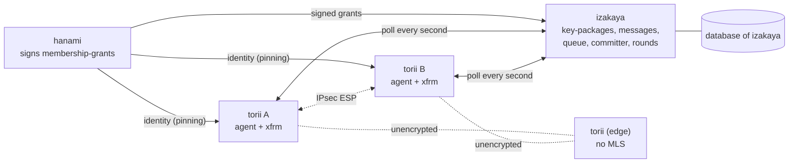
```mermaid
flowchart LR
    hanami["hanami<br/>signs membership-grants"]
    izakaya["izakaya<br/>key-packages, messages,<br/>queue, committer, rounds"]
    db[("database of izakaya")]
    toriiA["torii A<br/>agent + xfrm"]
    toriiB["torii B<br/>agent + xfrm"]
    edge["torii (edge)<br/>no MLS"]

    hanami -- "identity (pinning)" --> toriiA
    hanami -- "identity (pinning)" --> toriiB
    hanami -- "signed grants" --> izakaya
    izakaya --- db
    toriiA <-->|poll every second| izakaya
    toriiB <-->|poll every second| izakaya
    toriiA <-.->|IPsec ESP| toriiB
    toriiA -.-|unencrypted| edge
    toriiB -.-|unencrypted| edge
```

### Trust

hanami is the only one, who decides about the membership. Its public key is part of the configs of
izakaya and of every torii. A grant names the vni, the identity of the torii and its MLS
signature-key, which hanami pins with the first grant of a host:

- izakaya only accepts grants with a valid signature of hanami and only queues the addition of a
  torii, which has a grant.
- The committer checks the grant again, before it adds a torii, and only claims a key-package, which
  has exactly the granted signature-key.
- Every other member checks every addition of a commit against the grants, which are attached to
  the commit, before it follows the commit.

So neither a compromised izakaya nor a compromised torii can bring a torii into a group, which
hanami didn't allow.

## Placing a VM: identity-pinning and grant

hanami grants the membership with every VM of an encrypted network, which it places on a host,
before it creates the encrypted routes of the VM. It doesn't wait for the group: the torii join it
on their own.

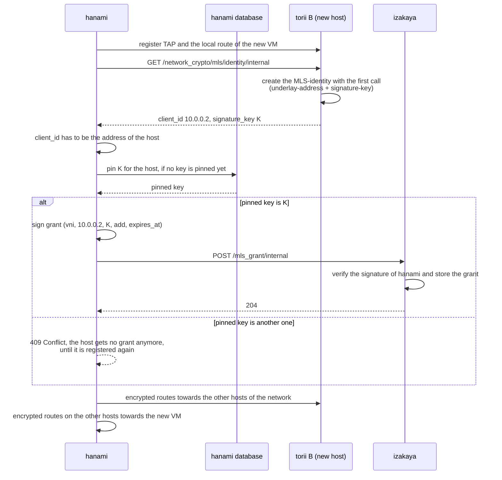
```mermaid
sequenceDiagram
    participant H as hanami
    participant DB as hanami database
    participant TB as torii B (new host)
    participant I as izakaya

    H->>TB: register TAP and the local route of the new VM
    H->>TB: GET /network_crypto/mls/identity/internal
    TB->>TB: create the MLS-identity with the first call<br/>(underlay-address + signature-key)
    TB-->>H: client_id 10.0.0.2, signature_key K
    H->>H: client_id has to be the address of the host
    H->>DB: pin K for the host, if no key is pinned yet
    DB-->>H: pinned key
    alt pinned key is K
        H->>H: sign grant (vni, 10.0.0.2, K, add, expires_at)
        H->>I: POST /mls_grant/internal
        I->>I: verify the signature of hanami and store the grant
        I-->>H: 204
    else pinned key is another one
        H-->>H: 409 Conflict, the host gets no grant anymore,<br/>until it is registered again
    end
    H->>TB: encrypted routes towards the other hosts of the network
    H->>H: encrypted routes on the other hosts towards the new VM
```

### Refresh of the grants

Every instance of hanami refreshes all grants regularly from its own database: every host with a
VM of a network and a pinned signature-key gets its grant again. This keeps the grants of the
hosts, which keep their VMs, from expiring and brings them back, if izakaya lost them. The torii
is not asked for its key here, the pinned key is used.

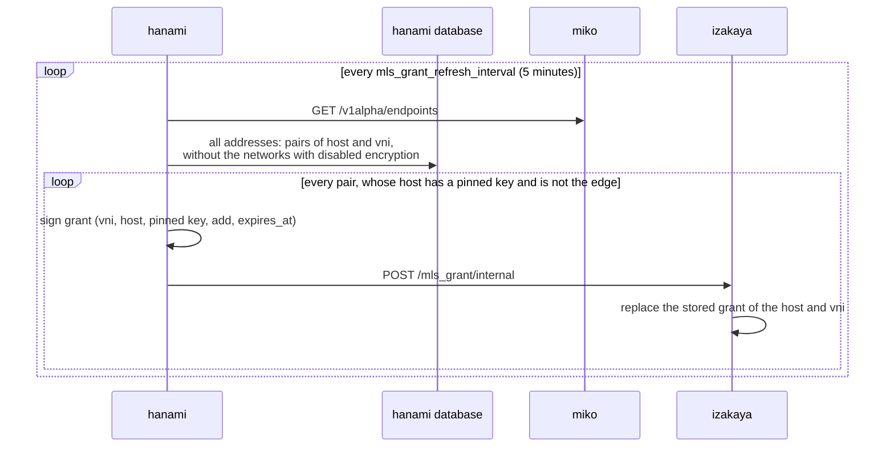
```mermaid
sequenceDiagram
    participant H as hanami
    participant DB as hanami database
    participant M as miko
    participant I as izakaya

    loop every mls_grant_refresh_interval (5 minutes)
        H->>M: GET /v1alpha/endpoints
        H->>DB: all addresses: pairs of host and vni,<br/>without the networks with disabled encryption
        loop every pair, whose host has a pinned key and is not the edge
            H->>H: sign grant (vni, host, pinned key, add, expires_at)
            H->>I: POST /mls_grant/internal
            I->>I: replace the stored grant of the host and vni
        end
    end
```

## Background-loop of the torii

Every second the agent of a torii runs through the same steps. Which groups it subscribes to only
depends on its own routes: the network has a VM behind this torii and an encrypted route towards
another host.

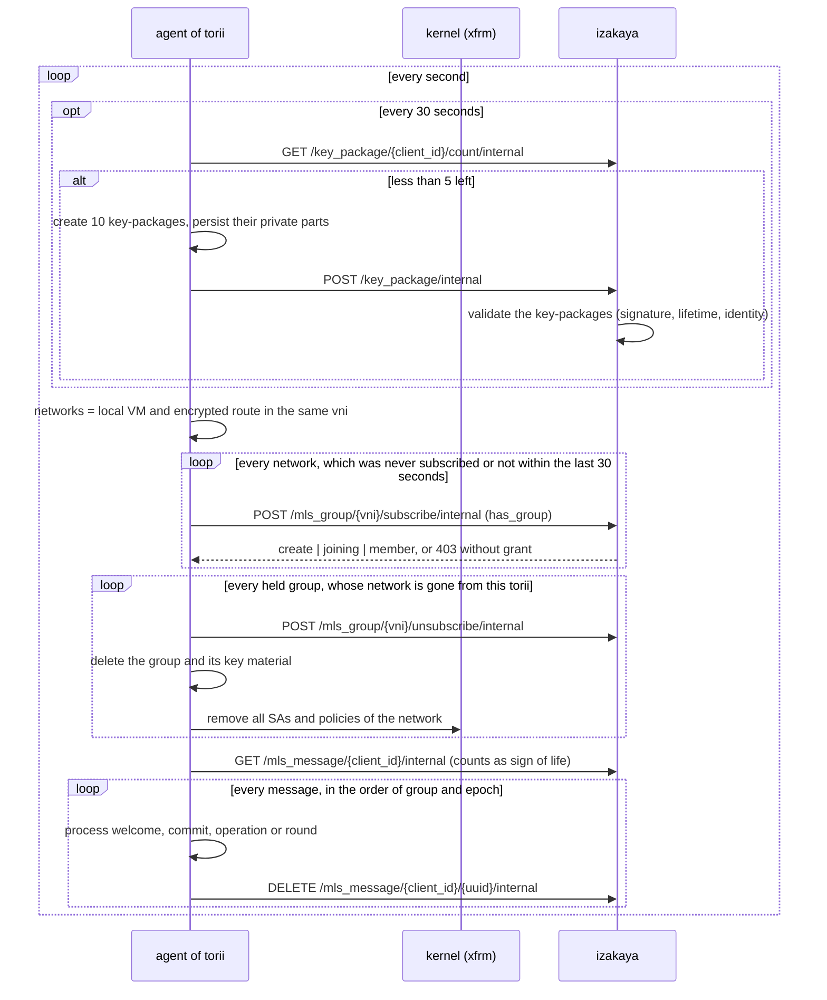
```mermaid
sequenceDiagram
    participant A as agent of torii
    participant K as kernel (xfrm)
    participant I as izakaya

    loop every second
        opt every 30 seconds
            A->>I: GET /key_package/{client_id}/count/internal
            alt less than 5 left
                A->>A: create 10 key-packages, persist their private parts
                A->>I: POST /key_package/internal
                I->>I: validate the key-packages (signature, lifetime, identity)
            end
        end

        A->>A: networks = local VM and encrypted route in the same vni
        loop every network, which was never subscribed or not within the last 30 seconds
            A->>I: POST /mls_group/{vni}/subscribe/internal (has_group)
            I-->>A: create | joining | member, or 403 without grant
        end
        loop every held group, whose network is gone from this torii
            A->>I: POST /mls_group/{vni}/unsubscribe/internal
            A->>A: delete the group and its key material
            A->>K: remove all SAs and policies of the network
        end

        A->>I: GET /mls_message/{client_id}/internal (counts as sign of life)
        loop every message, in the order of group and epoch
            A->>A: process welcome, commit, operation or round
            A->>I: DELETE /mls_message/{client_id}/{uuid}/internal
        end
    end
```

## Creating a group and adding a second torii

The first torii, which subscribes to a network, creates its group and becomes its committer. Every
further torii is added by the committer. Both get grants from hanami, when their VMs are placed.

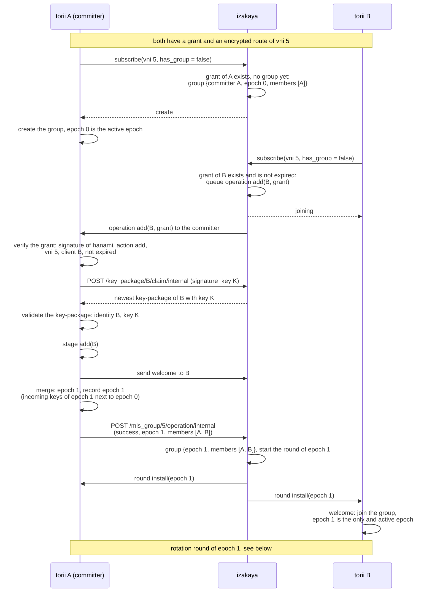
```mermaid
sequenceDiagram
    participant TA as torii A (committer)
    participant I as izakaya
    participant TB as torii B

    Note over TA,TB: both have a grant and an encrypted route of vni 5

    TA->>I: subscribe(vni 5, has_group = false)
    I->>I: grant of A exists, no group yet:<br/>group {committer A, epoch 0, members [A]}
    I-->>TA: create
    TA->>TA: create the group, epoch 0 is the active epoch

    TB->>I: subscribe(vni 5, has_group = false)
    I->>I: grant of B exists and is not expired:<br/>queue operation add(B, grant)
    I-->>TB: joining
    I->>TA: operation add(B, grant) to the committer

    TA->>TA: verify the grant: signature of hanami, action add,<br/>vni 5, client B, not expired
    TA->>I: POST /key_package/B/claim/internal (signature_key K)
    I-->>TA: newest key-package of B with key K
    TA->>TA: validate the key-package: identity B, key K
    TA->>TA: stage add(B)
    TA->>I: send welcome to B
    TA->>TA: merge: epoch 1, record epoch 1<br/>(incoming keys of epoch 1 next to epoch 0)
    TA->>I: POST /mls_group/5/operation/internal<br/>(success, epoch 1, members [A, B])
    I->>I: group {epoch 1, members [A, B]}, start the round of epoch 1
    I->>TA: round install(epoch 1)
    I->>TB: round install(epoch 1)

    TB->>TB: welcome: join the group,<br/>epoch 1 is the only and active epoch
    Note over TA,TB: rotation round of epoch 1, see below
```

## Adding a torii to a group with more members

With more members, the commit of the addition goes to all other members. The grant of the new
torii is attached to it, so every member can check, that hanami allowed the addition.

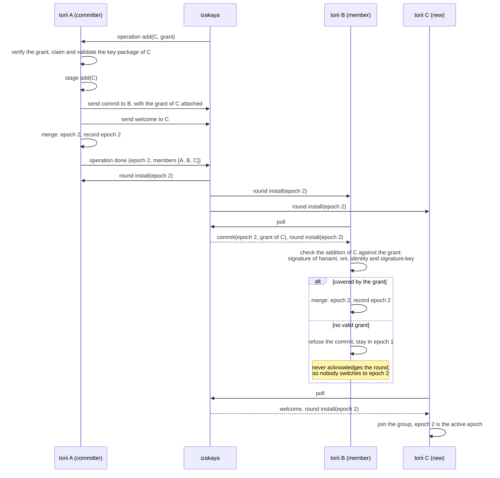
```mermaid
sequenceDiagram
    participant TA as torii A (committer)
    participant I as izakaya
    participant TB as torii B (member)
    participant TC as torii C (new)

    I->>TA: operation add(C, grant)
    TA->>TA: verify the grant, claim and validate the key-package of C
    TA->>TA: stage add(C)
    TA->>I: send commit to B, with the grant of C attached
    TA->>I: send welcome to C
    TA->>TA: merge: epoch 2, record epoch 2
    TA->>I: operation done (epoch 2, members [A, B, C])
    I->>TA: round install(epoch 2)
    I->>TB: round install(epoch 2)
    I->>TC: round install(epoch 2)

    TB->>I: poll
    I-->>TB: commit(epoch 2, grant of C), round install(epoch 2)
    TB->>TB: check the addition of C against the grant:<br/>signature of hanami, vni, identity and signature-key
    alt covered by the grant
        TB->>TB: merge: epoch 2, record epoch 2
    else no valid grant
        TB->>TB: refuse the commit, stay in epoch 1
        Note over TB: never acknowledges the round,<br/>so nobody switches to epoch 2
    end

    TC->>I: poll
    I-->>TC: welcome, round install(epoch 2)
    TC->>TC: join the group, epoch 2 is the active epoch
```

## Rotation round

After every change of a group, the keys of the new epoch are rolled out in three phases without
losing a packet. Each phase only starts, once every member acknowledged the previous one. In
between, every torii holds the incoming keys of the old and of the new epoch, so both ends of a
route can always decrypt, what the other end sends.

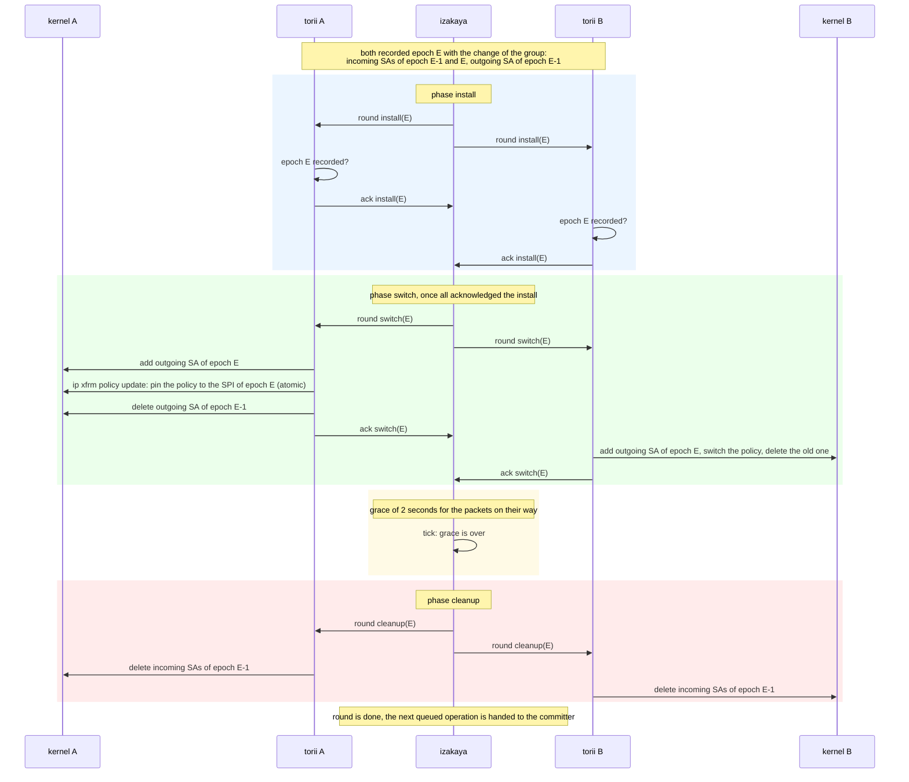
```mermaid
sequenceDiagram
    participant KA as kernel A
    participant TA as torii A
    participant I as izakaya
    participant TB as torii B
    participant KB as kernel B

    Note over TA,TB: both recorded epoch E with the change of the group:<br/>incoming SAs of epoch E-1 and E, outgoing SA of epoch E-1

    rect rgb(235, 245, 255)
    Note over I: phase install
    I->>TA: round install(E)
    I->>TB: round install(E)
    TA->>TA: epoch E recorded?
    TA->>I: ack install(E)
    TB->>TB: epoch E recorded?
    TB->>I: ack install(E)
    end

    rect rgb(235, 255, 235)
    Note over I: phase switch, once all acknowledged the install
    I->>TA: round switch(E)
    I->>TB: round switch(E)
    TA->>KA: add outgoing SA of epoch E
    TA->>KA: ip xfrm policy update: pin the policy to the SPI of epoch E (atomic)
    TA->>KA: delete outgoing SA of epoch E-1
    TA->>I: ack switch(E)
    TB->>KB: add outgoing SA of epoch E, switch the policy, delete the old one
    TB->>I: ack switch(E)
    end

    rect rgb(255, 250, 230)
    Note over I: grace of 2 seconds for the packets on their way
    I->>I: tick: grace is over
    end

    rect rgb(255, 235, 235)
    Note over I: phase cleanup
    I->>TA: round cleanup(E)
    I->>TB: round cleanup(E)
    TA->>KA: delete incoming SAs of epoch E-1
    TB->>KB: delete incoming SAs of epoch E-1
    end

    Note over I: round is done, the next queued operation is handed to the committer
```

### Key-derivation

All members export the same base secret from an epoch, as soon as they enter it, and derive the
SA of every direction of every VM-pair from it. The receiving torii derives exactly the key, which
the sending torii uses.

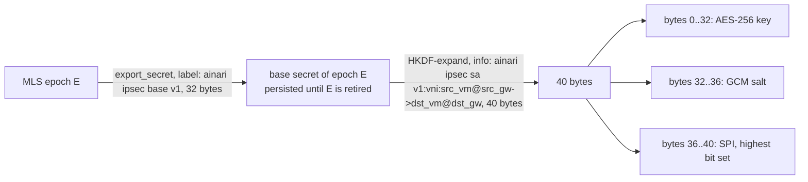
```mermaid
flowchart LR
    epoch["MLS epoch E"] -- "export_secret, label: ainari ipsec base v1, 32 bytes" --> base["base secret of epoch E<br/>persisted until E is retired"]
    base -- "HKDF-expand, info: ainari ipsec sa v1:vni:src_vm@src_gw->dst_vm@dst_gw, 40 bytes" --> okm["40 bytes"]
    okm --> key["bytes 0..32: AES-256 key"]
    okm --> salt["bytes 32..36: GCM salt"]
    okm --> spi["bytes 36..40: SPI, highest bit set"]
```

## Removing a torii

When the last VM of a network is deleted from a host, hanami removes the routes and revokes the
grant. The torii itself unsubscribes as well, as soon as its routes of the network are gone. Both
lead to the same removal, which is only queued once.

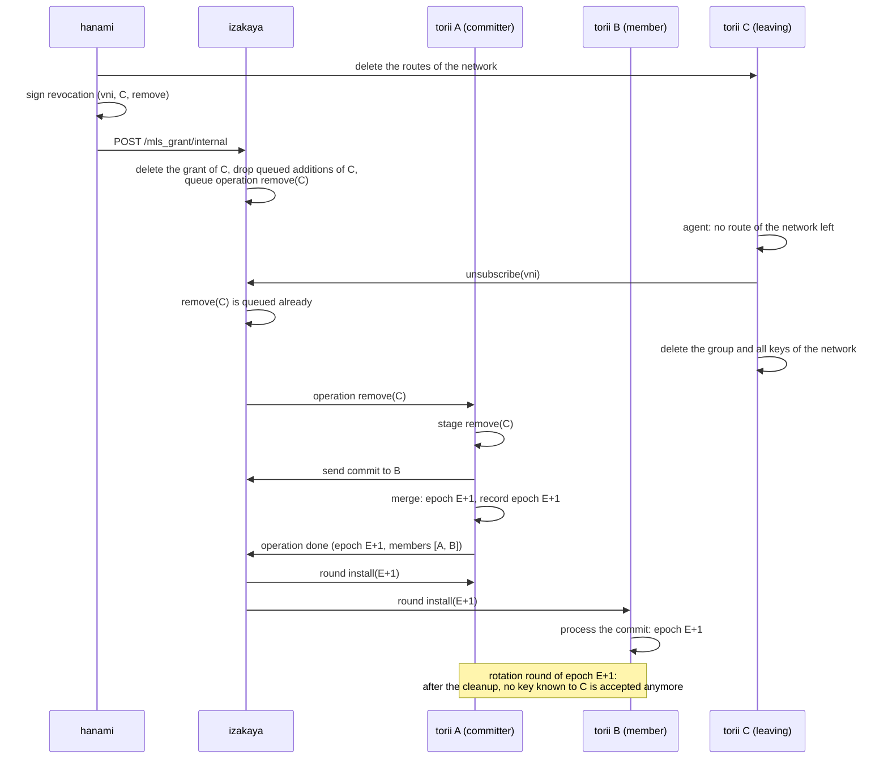
```mermaid
sequenceDiagram
    participant H as hanami
    participant I as izakaya
    participant TA as torii A (committer)
    participant TB as torii B (member)
    participant TC as torii C (leaving)

    H->>TC: delete the routes of the network
    H->>H: sign revocation (vni, C, remove)
    H->>I: POST /mls_grant/internal
    I->>I: delete the grant of C, drop queued additions of C,<br/>queue operation remove(C)

    TC->>TC: agent: no route of the network left
    TC->>I: unsubscribe(vni)
    I->>I: remove(C) is queued already
    TC->>TC: delete the group and all keys of the network

    I->>TA: operation remove(C)
    TA->>TA: stage remove(C)
    TA->>I: send commit to B
    TA->>TA: merge: epoch E+1, record epoch E+1
    TA->>I: operation done (epoch E+1, members [A, B])
    I->>TA: round install(E+1)
    I->>TB: round install(E+1)
    TB->>TB: process the commit: epoch E+1
    Note over TA,TB: rotation round of epoch E+1:<br/>after the cleanup, no key known to C is accepted anymore
```

If the leaving torii is the committer, another living member becomes committer before the removal
is handed out. If it is the last member, the group is deleted together with its queue.

## Regular key-rotation

Groups, whose membership doesn't change, get new keys as well. This also keeps the sequence
numbers of the SAs far away from their end.

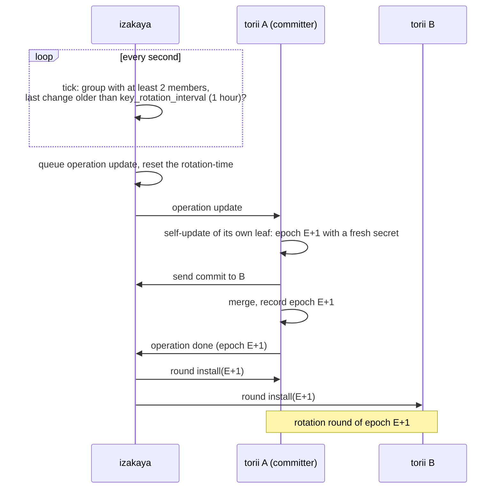
```mermaid
sequenceDiagram
    participant I as izakaya
    participant TA as torii A (committer)
    participant TB as torii B

    loop every second
        I->>I: tick: group with at least 2 members,<br/>last change older than key_rotation_interval (1 hour)?
    end
    I->>I: queue operation update, reset the rotation-time
    I->>TA: operation update
    TA->>TA: self-update of its own leaf: epoch E+1 with a fresh secret
    TA->>I: send commit to B
    TA->>TA: merge, record epoch E+1
    TA->>I: operation done (epoch E+1)
    I->>TA: round install(E+1)
    I->>TB: round install(E+1)
    Note over TA,TB: rotation round of epoch E+1
```

## Changed routes

The keys only exist for the routes, which the torii has. A route, which is added, changed or
deleted, brings the keys of its network in line right away, without any message to the izakaya.

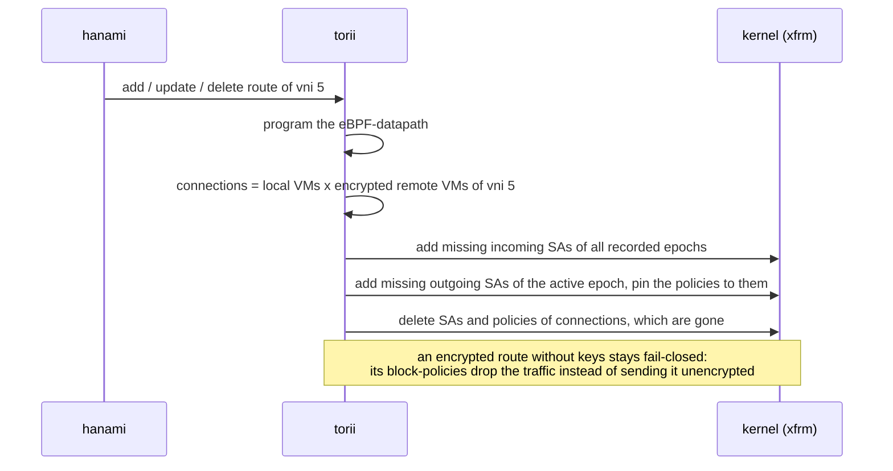
```mermaid
sequenceDiagram
    participant H as hanami
    participant T as torii
    participant K as kernel (xfrm)

    H->>T: add / update / delete route of vni 5
    T->>T: program the eBPF-datapath
    T->>T: connections = local VMs x encrypted remote VMs of vni 5
    T->>K: add missing incoming SAs of all recorded epochs
    T->>K: add missing outgoing SAs of the active epoch, pin the policies to them
    T->>K: delete SAs and policies of connections, which are gone
    Note over T,K: an encrypted route without keys stays fail-closed:<br/>its block-policies drop the traffic instead of sending it unencrypted
```

## Failures

### Restart of a torii

The MLS-state of a torii is persisted in its database, so a restart changes nothing for the group.

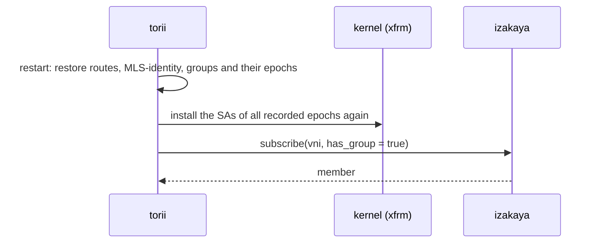
```mermaid
sequenceDiagram
    participant T as torii
    participant K as kernel (xfrm)
    participant I as izakaya

    T->>T: restart: restore routes, MLS-identity, groups and their epochs
    T->>K: install the SAs of all recorded epochs again
    T->>I: subscribe(vni, has_group = true)
    I-->>T: member
```

### Torii lost its MLS-state

The MLS-identity of a torii is part of its MLS-state. A torii, which lost its database, comes back
with the same address, but with a new signature-key. hanami pinned the old key, and the grant at
izakaya still names it, so the committer finds no key-package with the granted key and refuses the
addition. The encrypted routes of the torii stay fail-closed, until its host is registered again,
which lets hanami pin the new key and grant it with the next VM.

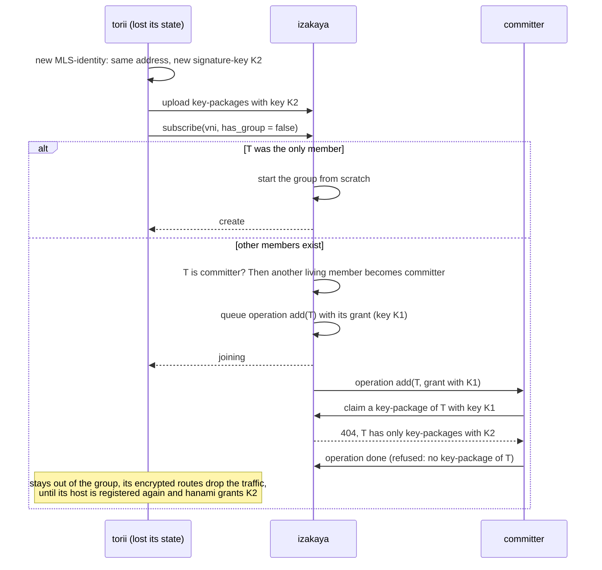
```mermaid
sequenceDiagram
    participant T as torii (lost its state)
    participant I as izakaya
    participant C as committer

    T->>T: new MLS-identity: same address, new signature-key K2
    T->>I: upload key-packages with key K2
    T->>I: subscribe(vni, has_group = false)
    alt T was the only member
        I->>I: start the group from scratch
        I-->>T: create
    else other members exist
        I->>I: T is committer? Then another living member becomes committer
        I->>I: queue operation add(T) with its grant (key K1)
        I-->>T: joining
        I->>C: operation add(T, grant with K1)
        C->>I: claim a key-package of T with key K1
        I-->>C: 404, T has only key-packages with K2
        C->>I: operation done (refused: no key-package of T)
        Note over T: stays out of the group, its encrypted routes drop the traffic,<br/>until its host is registered again and hanami grants K2
    end
```

### Dead committer

A torii counts as dead, when it didn't poll for 45 seconds. An operation, which is not finished
after 30 seconds, is handed out again, if necessary to another committer. After 3 attempts it is
given up.

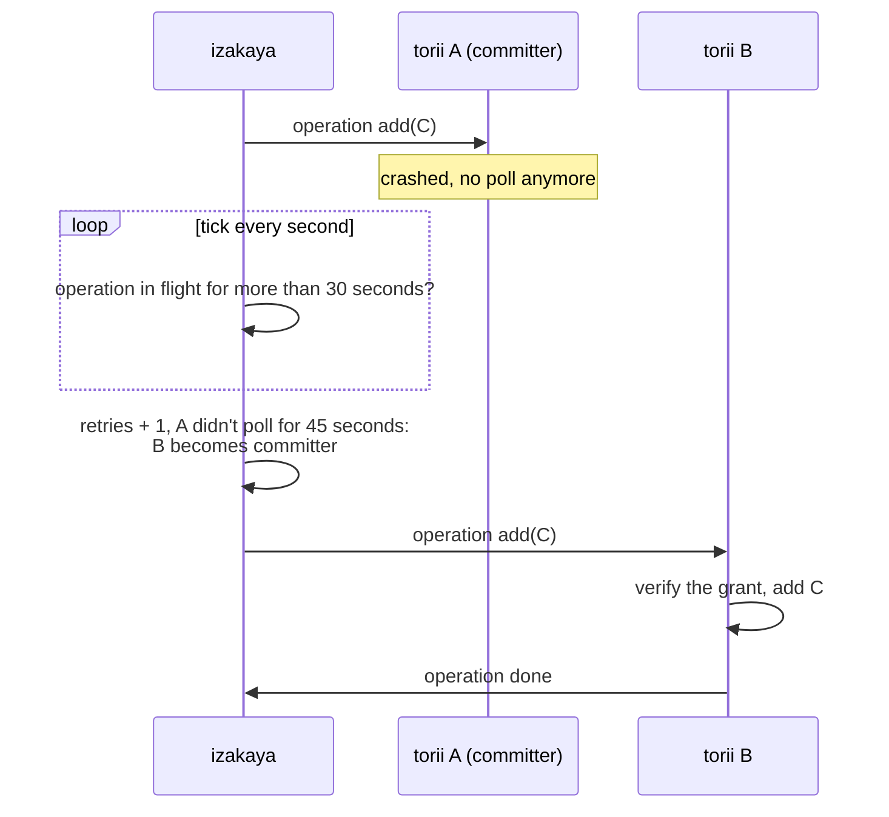
```mermaid
sequenceDiagram
    participant I as izakaya
    participant TA as torii A (committer)
    participant TB as torii B

    I->>TA: operation add(C)
    Note over TA: crashed, no poll anymore
    loop tick every second
        I->>I: operation in flight for more than 30 seconds?
    end
    I->>I: retries + 1, A didn't poll for 45 seconds:<br/>B becomes committer
    I->>TB: operation add(C)
    TB->>TB: verify the grant, add C
    TB->>I: operation done
```

### Stalled round

If a member doesn't acknowledge a phase, for example because it is down or refused the commit, the
round is given up after 30 seconds. Nobody loses a key: the members, which already switched, and
the ones, which didn't, still hold the incoming keys of both epochs. The next round removes the
leftover keys.

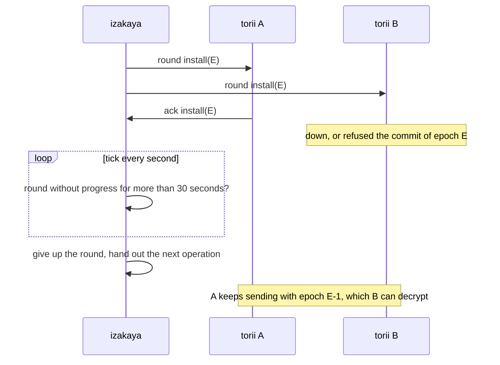
```mermaid
sequenceDiagram
    participant I as izakaya
    participant TA as torii A
    participant TB as torii B

    I->>TA: round install(E)
    I->>TB: round install(E)
    TA->>I: ack install(E)
    Note over TB: down, or refused the commit of epoch E
    loop tick every second
        I->>I: round without progress for more than 30 seconds?
    end
    I->>I: give up the round, hand out the next operation
    Note over TA,TB: A keeps sending with epoch E-1, which B can decrypt
```

### Restart of izakaya

All state of izakaya is in its database, so a restart of one instance changes nothing.

If the database is lost, the grants, the key-packages, the queues and the groups are lost with it.
Everything comes back on its own:

- hanami brings the grants back with its next refresh.
- The torii upload new key-packages, as soon as they see, that izakaya has less than 5 of them.
- The torii renew their subscriptions every 30 seconds. The first one gets `create` and starts a
  new group, the others join it.

The torii keep sending with the keys of the old group, until the first rotation round of the new
group switched all of them over, and keep its incoming keys until the cleanup of that round. So
the replacement of the group doesn't lose a packet either.

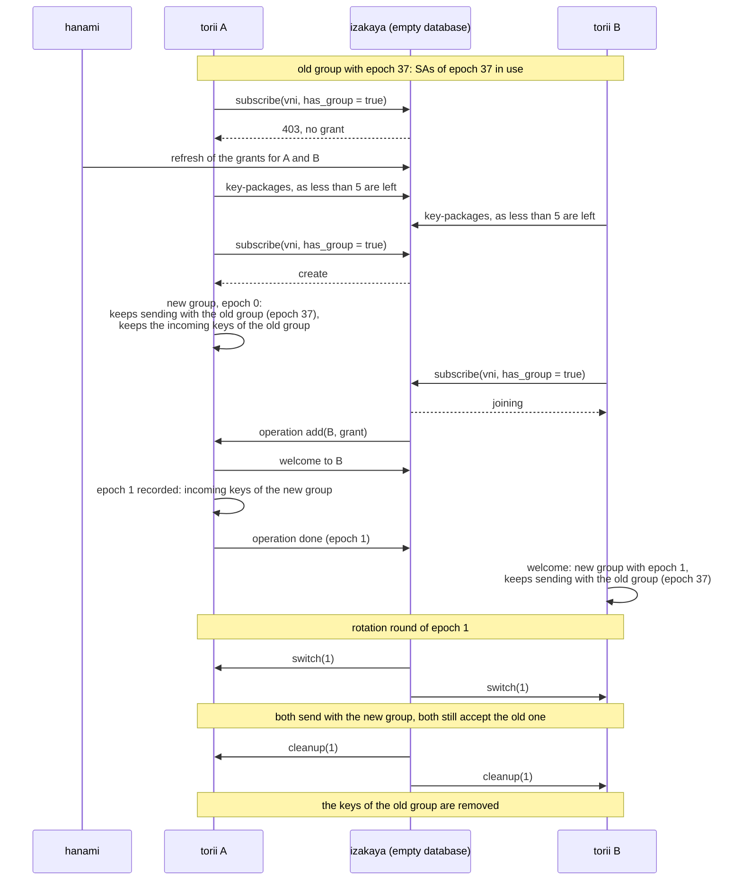
```mermaid
sequenceDiagram
    participant H as hanami
    participant TA as torii A
    participant I as izakaya (empty database)
    participant TB as torii B

    Note over TA,TB: old group with epoch 37: SAs of epoch 37 in use

    TA->>I: subscribe(vni, has_group = true)
    I-->>TA: 403, no grant
    H->>I: refresh of the grants for A and B
    TA->>I: key-packages, as less than 5 are left
    TB->>I: key-packages, as less than 5 are left

    TA->>I: subscribe(vni, has_group = true)
    I-->>TA: create
    TA->>TA: new group, epoch 0:<br/>keeps sending with the old group (epoch 37),<br/>keeps the incoming keys of the old group

    TB->>I: subscribe(vni, has_group = true)
    I-->>TB: joining
    I->>TA: operation add(B, grant)
    TA->>I: welcome to B
    TA->>TA: epoch 1 recorded: incoming keys of the new group
    TA->>I: operation done (epoch 1)
    TB->>TB: welcome: new group with epoch 1,<br/>keeps sending with the old group (epoch 37)

    Note over TA,TB: rotation round of epoch 1
    I->>TA: switch(1)
    I->>TB: switch(1)
    Note over TA,TB: both send with the new group, both still accept the old one
    I->>TA: cleanup(1)
    I->>TB: cleanup(1)
    Note over TA,TB: the keys of the old group are removed
```
