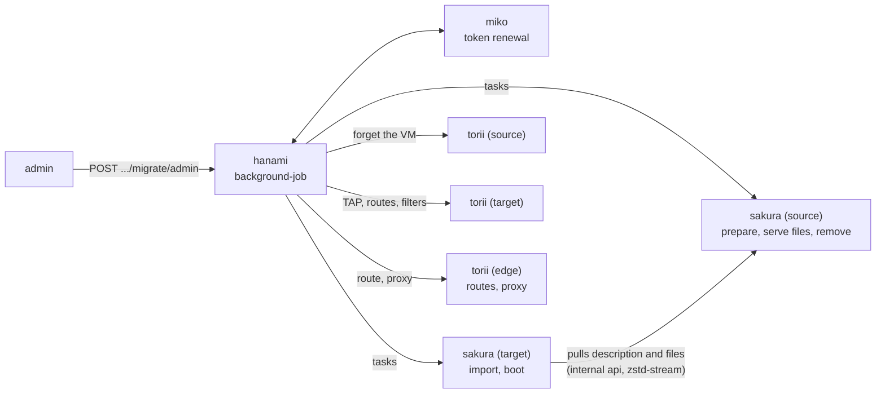
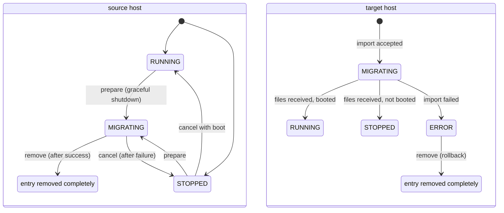
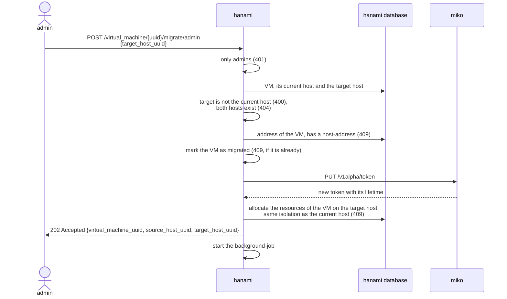
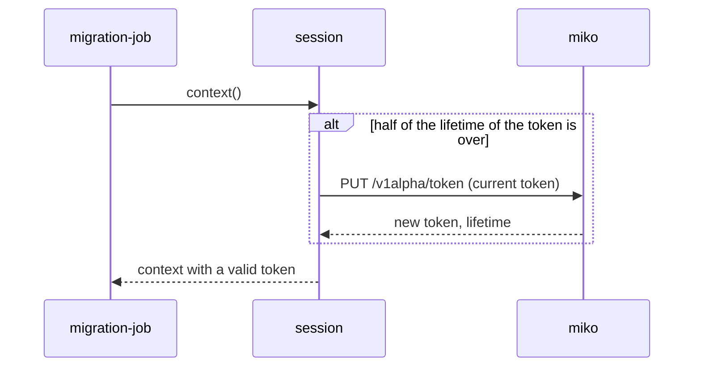
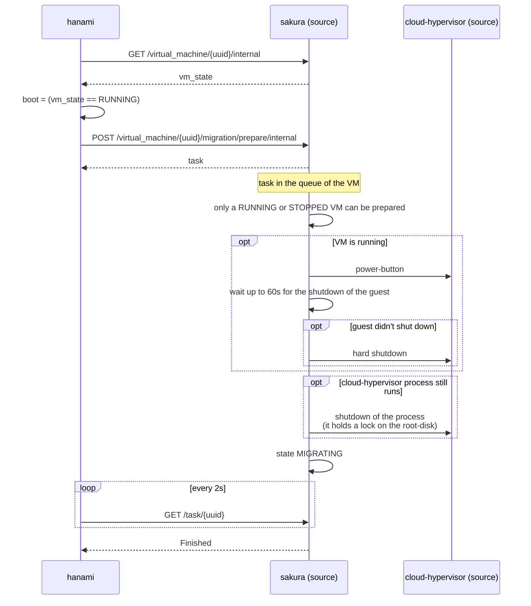
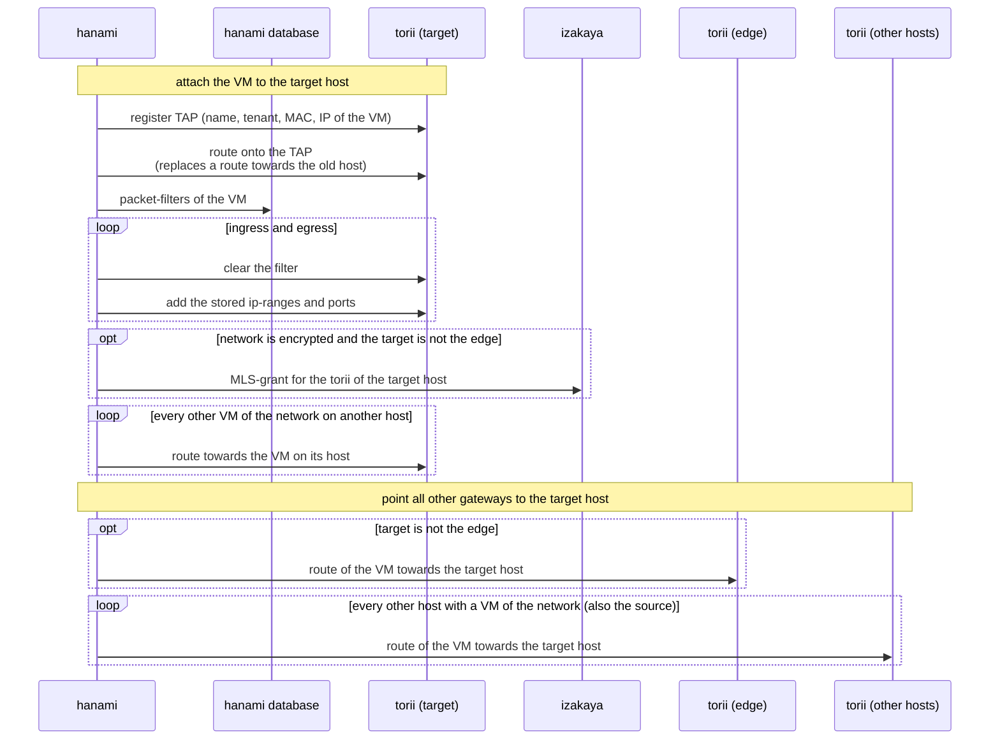
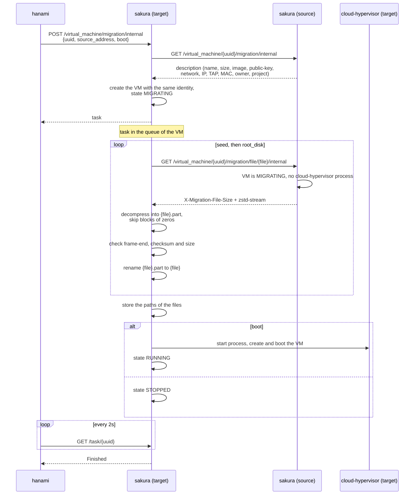
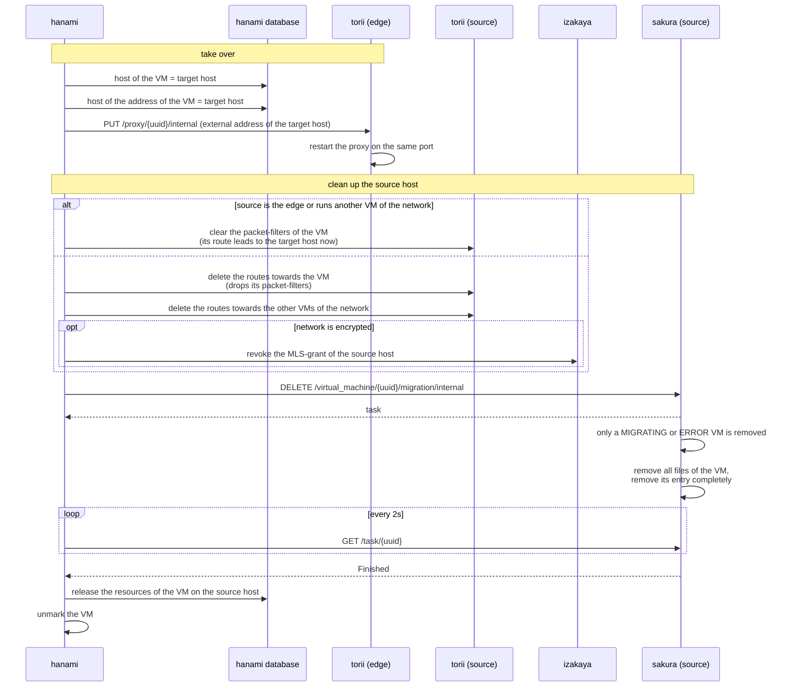
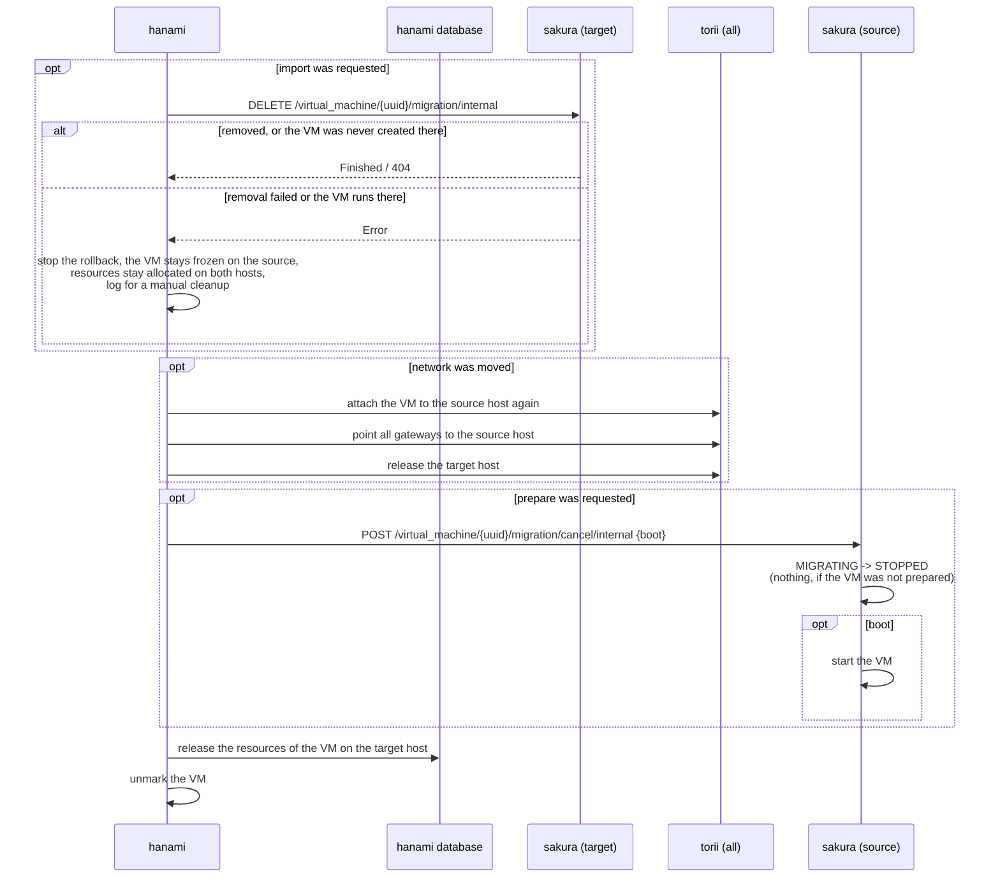

# Cold migration of a virtual machine

An admin can move a virtual machine to another sakura-host. The migration is a cold migration: the
virtual machine is shut down on its current host, its disk is transferred directly to the new host
and it is booted there again, if it was running before. It keeps its UUID, its internal address,
its MAC-address, its TAP-device, its proxy-port and its packet-filters.

hanami orchestrates the migration in a background-job. The sakura-hosts only provide the single
steps, which run as tasks of the virtual machine, so they are serialized with all other tasks of
it, like a start or a snapshot.

## Components

| Component | Role |
|---|---|
| **hanami** | Accepts the request of the admin, allocates the resources on the new host and runs the background-job, which calls all other components. It moves the network of the virtual machine between the gateways and rolls the migration back, if a step fails. |
| **miko** | Renews the token of the admin during the migration, because the transfer of a large disk can take longer than the lifetime of a token. |
| **sakura** (source) | *Prepares* the virtual machine: shuts it down and freezes it in the state `MIGRATING`. Serves its description and its files to the target and removes its copy at the end. |
| **sakura** (target) | *Imports* the virtual machine: creates it with the same identity, pulls its seed-image and its root-disk from the source and boots it. |
| **torii** (hosts) | Get the TAP-device, the routes and the packet-filters of the virtual machine on the new host and forget them on the old host. |
| **torii** (edge) | Routes the address of the virtual machine to the new host and points the proxy-port of the virtual machine to the new host. |
| **izakaya** | Gets the MLS-grant for the torii of the new host, if the network is encrypted, and its revocation for the old host (see [Key-exchange of the network-encryption](network_crypto_key_exchange.md)). |

## States of the virtual machine

The virtual machine exists on both hosts during the migration. The state `MIGRATING` blocks every
other operation on it: sakura rejects start, stop, reboot and the snapshots, hanami rejects the
deletion and changes of the packet-filters.

A removed virtual machine leaves no deleted entry behind, unlike a normal deletion. The deleted
entries are reported to hanami, when the host registers itself again, which would delete the
virtual machine, which still exists on the other host. It also allows to migrate the virtual
machine back to a host, which ran it before.

## Start of the migration

The request is checked completely and the resources are allocated on the new host, before it is
accepted. Everything afterwards runs in the background.

### Renewal of the token

The sakura-hosts accept their internal endpoints only with a valid token, so the job holds a
session, which renews the token at miko, as soon as half of its lifetime is over. Every call of the
job takes its token from this session.

## Step 1: prepare the virtual machine on the source host

The steps on the sakura-hosts are tasks. hanami follows every task by polling it every 2 seconds,
until it is finished or failed.

## Step 2: move the network to the target host

The VM is shut down now, so its network can be moved, before it is started on the target host.
The packet-filters are applied on the new torii, before the VM can send anything, so it is never
reachable without them. Every call only changes, what differs, so the steps can be repeated.

## Step 3: import the virtual machine on the target host

The target host pulls the files directly from the source host over the internal api of the source
host. The files are sent as a single zstd-frame each, which contains the size and a checksum of the
content. The root-disk is a sparse file, whose unused parts are zeros, which compress to almost
nothing, so the source host needs no temporary copy of it. The target host skips the blocks of
zeros, so the root-disk stays sparse.

## Step 4 and 5: take over and clean up the source host

The VM runs on the target host now. A failure from here on doesn't roll the migration back, but
is logged for a manual cleanup.

The TAP-device stays on the source host, like with the deletion of a virtual machine, because
torii has no endpoint to remove it.

## Rollback

A failure before the take-over moves the VM back to the source host. Every step is tried, also if
another one failed, and only undoes, what was already done. The only exception is the removal from
the target host: the removal runs after the import in the queue of the VM, so it also covers an
import, whose end was not seen, and refuses to remove a VM, which was imported successfully.
Without its confirmation, the rollback stops, because the VM could otherwise run on both hosts with
the same address.

## Limits

- The job lives only in the memory of hanami. If hanami restarts during a migration, the VM stays
  frozen in the state `MIGRATING` on the source host and has to be cleaned up by hand.
- The task-queues of sakura only live in its memory. At its start, sakura marks all tasks as failed,
  which didn't end before its restart. So a step of a migration, which was interrupted by a restart
  of its host, fails and the migration is rolled back.
- The files are transferred over the internal api of the sakura-hosts. They are only encrypted, if
  the address of the source host, which it registered at hanami, uses `https`.
