# Dashboard

The dashboard is the web-interface of Ainari. The address depends on the installation, for
example `https://local-ainari` for the [Kubernetes-installation](../../deployer/installation/kubernetes_installation.md)
or `http://localhost:5173` for a [local build](../../developer/build_guide.md#build-dashboard).

## Login

Log in with the ID and the passphrase of your user. The optional project-ID selects the project,
in which you want to work. Without it, you are logged in into your default-project. An invalid
project-ID, or a project, to which you are not assigned, is rejected with an `Unauthorized` error.

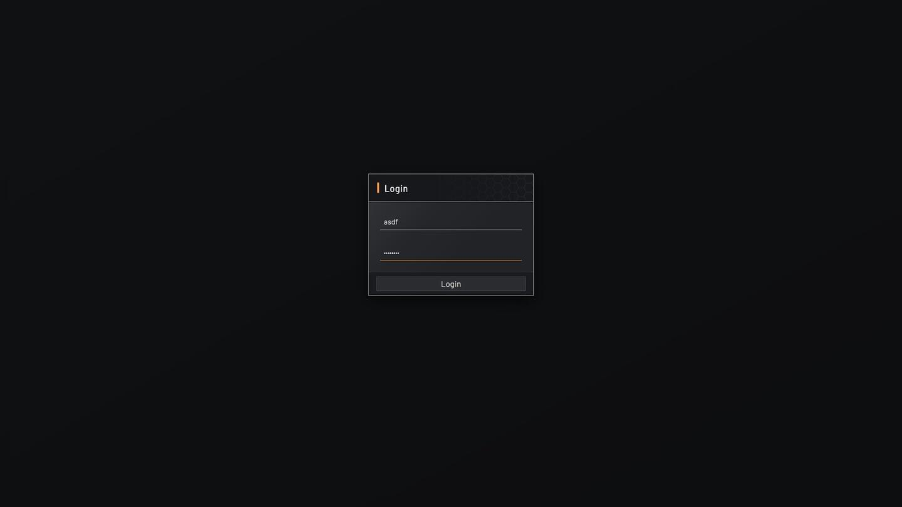

## Switch project

**Switch Project** in the menu behind the avatar in the upper right corner lists all projects, to
which you are assigned, together with your role in each of them. Select a project in the table and
accept, to continue within this project without a new login. All pages show the resources of the
selected project afterwards.

## Overview

After the login the overview shows, how many resources of each type exist compared to the quota of
the project, and a list of the virtual machines.

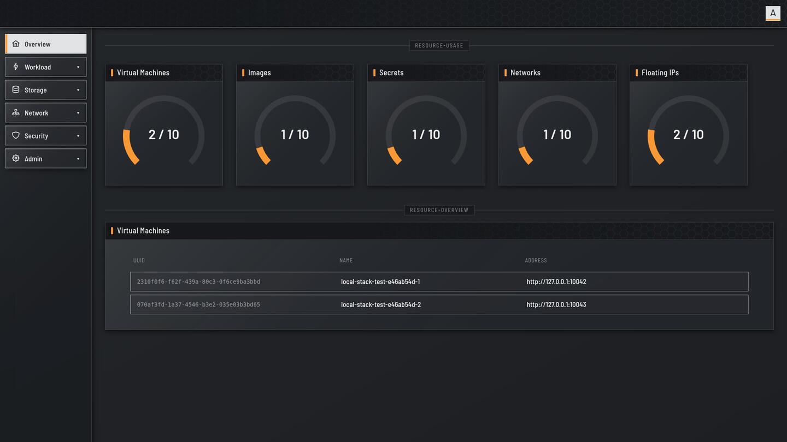

On the left side is the navigation to all other pages. The entries under **Admin** are only shown
for admins.

## Workflow: create a virtual machine

This workflow creates a virtual machine out of an ubuntu-cloud-image and makes it reachable over
ssh. Every page of the following steps has a **+**-button in its upper right corner, which opens
the dialog to create a new resource. The dialogs are confirmed with the check-mark.

### 1. Upload a public key

The public key is deployed into the virtual machine, so it is possible to log in with the private
key over ssh. Create a key-pair on your computer, if you don't have one already:

```bash
ssh-keygen -t ed25519 -f ~/.ssh/ainari_key
```

Go to **Security > Public Keys**, click **+**, enter a name and paste the content of the file
`~/.ssh/ainari_key.pub` in its one-line format:

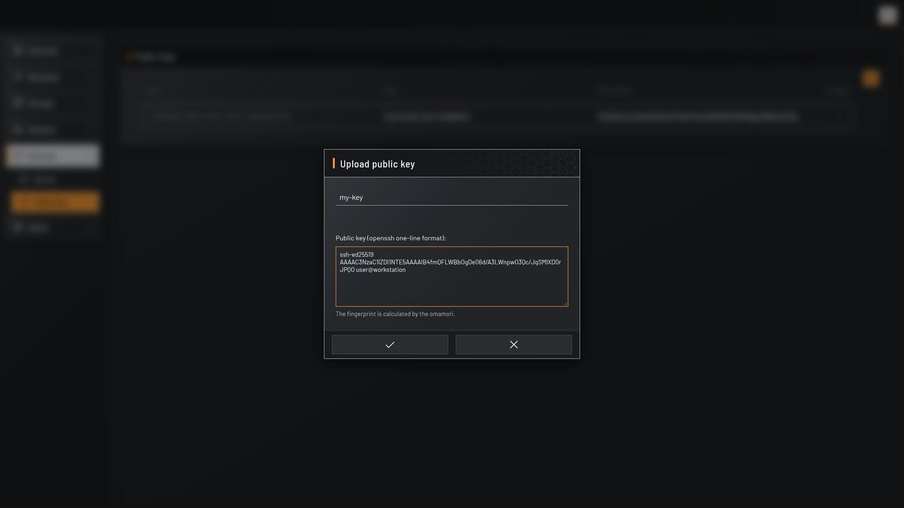

The new key is listed together with its fingerprint:

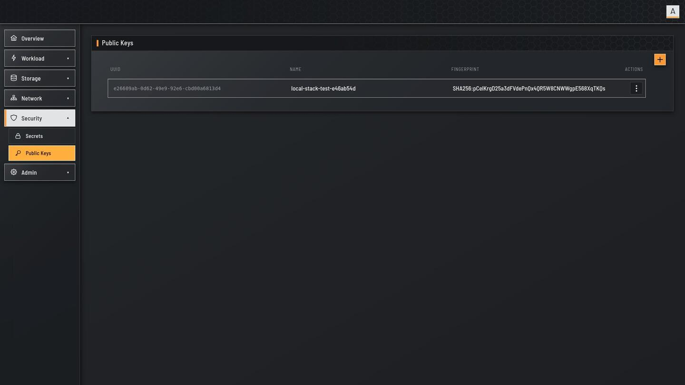

### 2. Upload an image

The image becomes the boot-disk of the virtual machine. Download an ubuntu-cloud-image:

```bash
wget https://cloud-images.ubuntu.com/noble/current/noble-server-cloudimg-amd64.img
```

Go to **Storage > Image**, click **+**, enter a name and select the downloaded file:

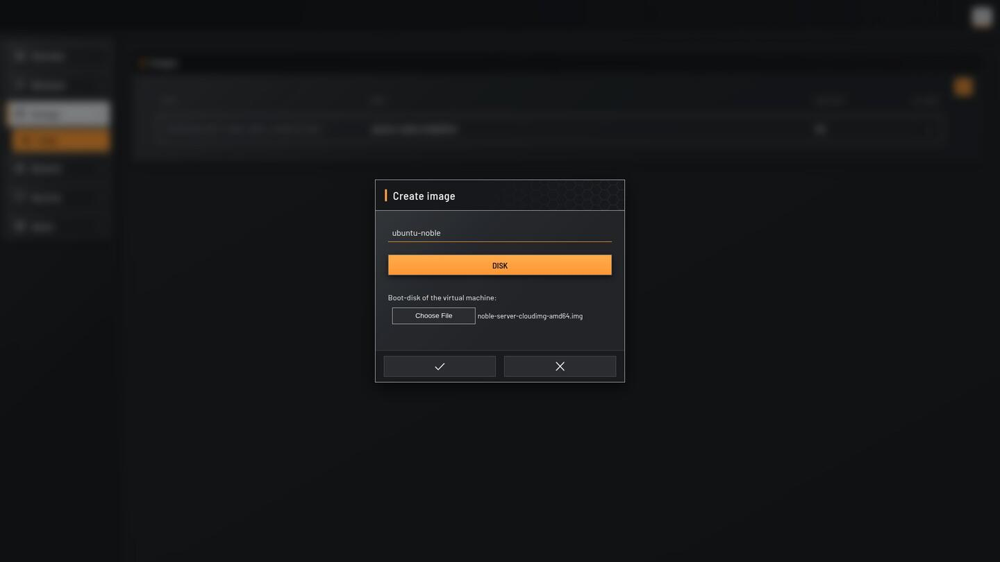

The image is stored encrypted. By default a new secret is generated for it. To encrypt it with an
already existing secret of **Security > Secrets** instead, select it in the **Secret**-dropdown.

The upload takes a while, depending on the size of the image. Afterwards the image is listed:

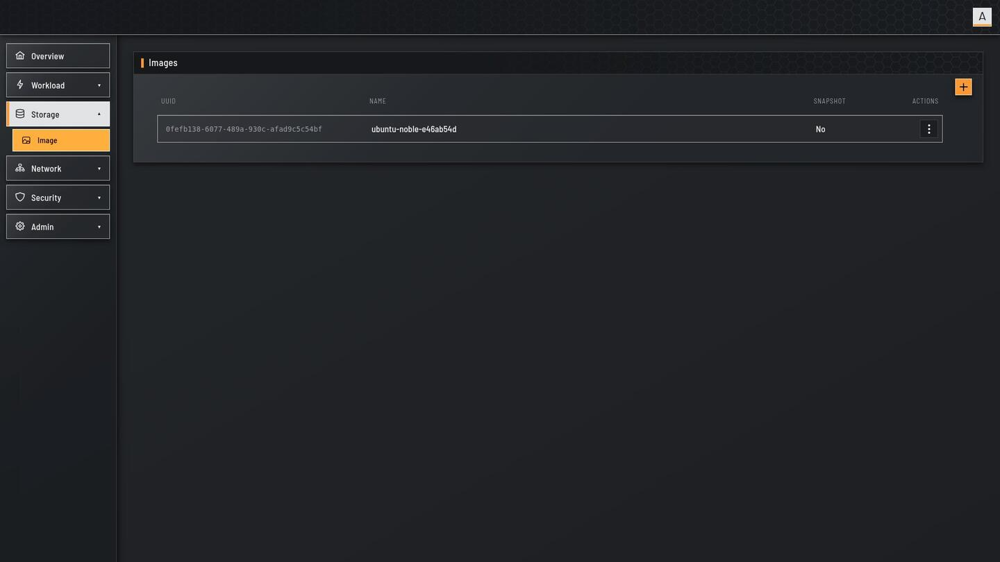

### 3. Create a network

Go to **Network > Networks**, click **+** and enter a name and the subnet of the network in
CIDR-notation. The first address of the subnet is the gateway of the virtual machines.

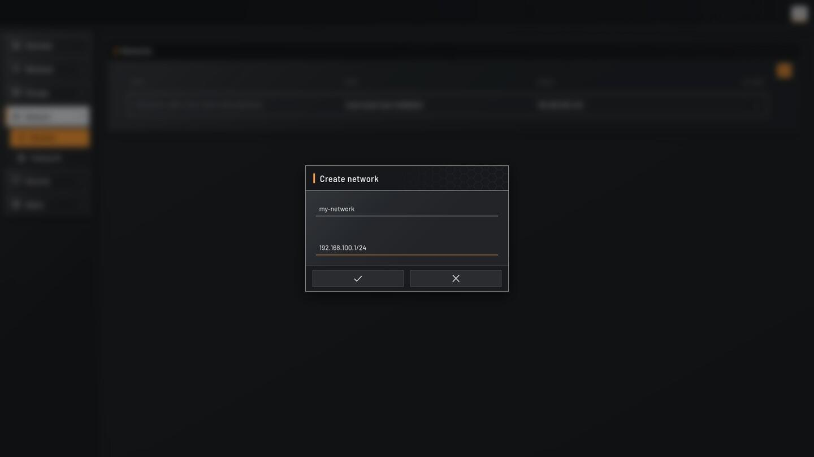

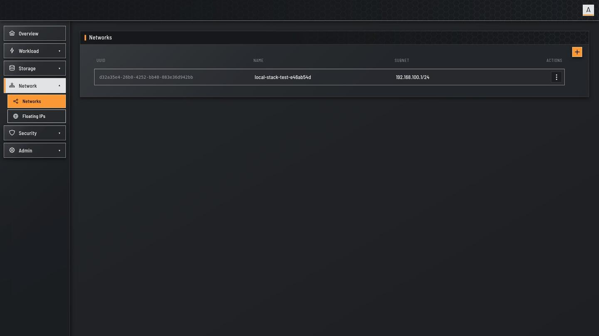

### 4. Create the virtual machine

Go to **Workload > Virtual Machines** and click **+**. Enter a name and the disk-size in GiB,
select the vm-type, which defines the number of cores and the memory of the virtual machine, and
select the network, the image and the public key of the previous steps:

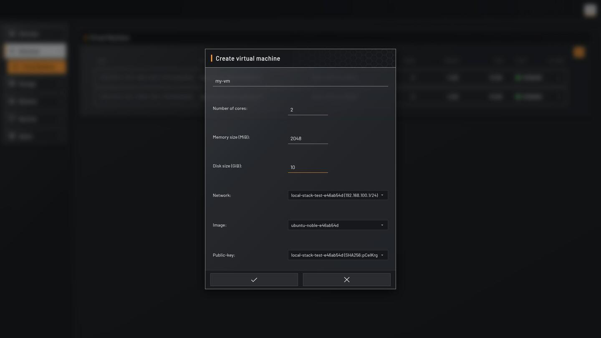

With **Isolated host** the virtual machine is only placed on a host, which an admin isolated for
single projects (see [Admin](#admin)). Otherwise it is only placed on hosts, which are not isolated.

The virtual machine is created in the background. Its state is shown in the column **State** and
changes to `RUNNING`, as soon as it is booted:

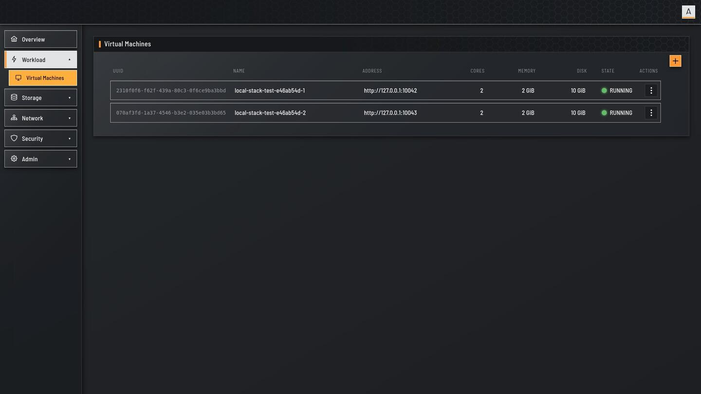

### 5. Add a floating IP

The floating IP makes the virtual machine reachable from the network outside of Ainari. Go to
**Network > Floating IPs**, click **+**, enter a name and select the virtual machine, to attach the
floating IP directly. Without an address, a free one is selected.

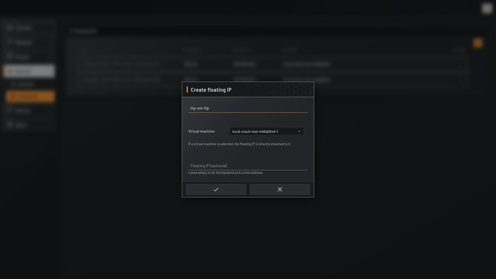

The floating IP is listed with the internal IP of the virtual machine, which it is attached to:

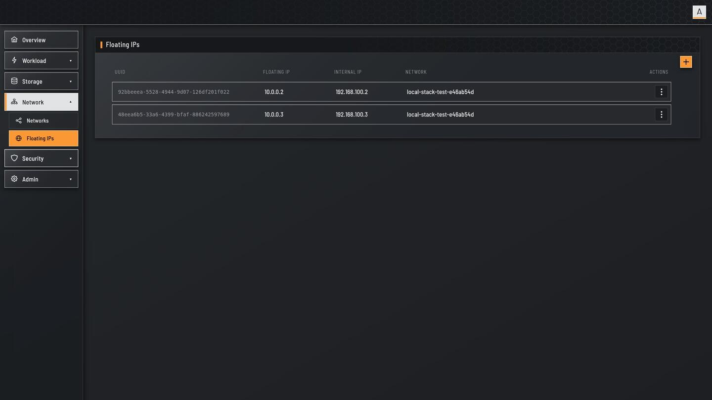

### 6. Log in over ssh

Log in with the private key of step 1 and the user `ubuntu` of the ubuntu-cloud-image. The virtual
machine needs a moment to boot, before it answers on ssh.

```bash
ssh -i ~/.ssh/ainari_key ubuntu@<FLOATING_IP>
```

## Pages

### Virtual Machines

**Workload > Virtual Machines** lists all virtual machines with their resources and their state.
The menu in the column **Actions** provides:

| Action                | Description                                                           |
| --------------------- | --------------------------------------------------------------------- |
| Info                  | all details of the virtual machine                                    |
| Show tasks            | the tasks of the virtual machine, see below                           |
| Show network filter   | the network filter of the virtual machine, see below                  |
| Start, Stop, Reboot   | change the power-state of the virtual machine                         |
| Save snapshot         | save the root-disk of the virtual machine as new image                |
| Restore from snapshot | reset the root-disk of the virtual machine to a snapshot              |
| Delete                | delete the virtual machine                                            |

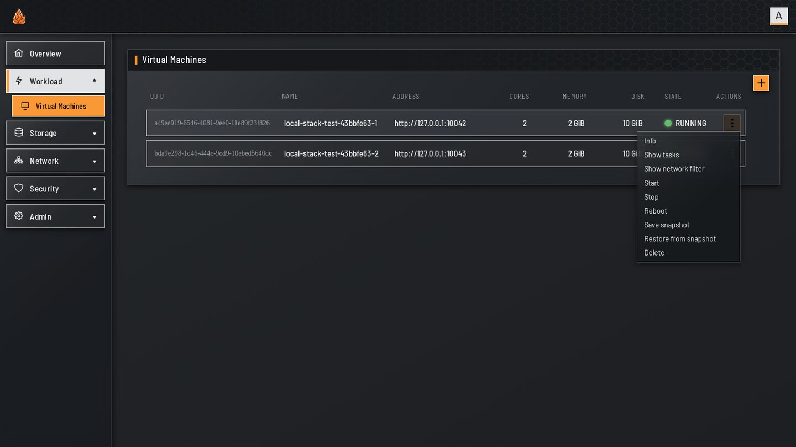

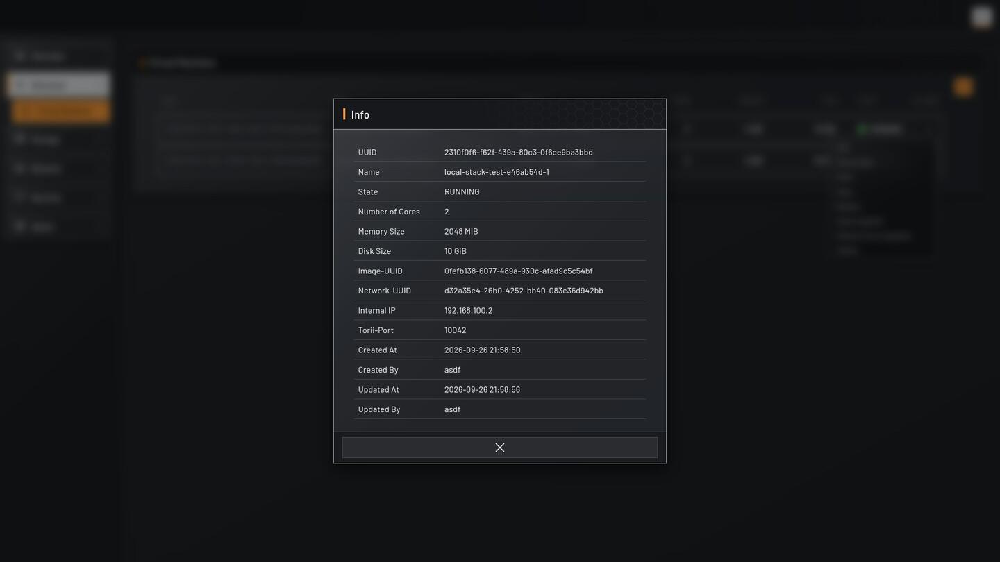

!!! info

    A snapshot of a running virtual machine is created while it is paused, so data, which is still
    in its memory, is missing in the snapshot. Run `sync` inside the virtual machine before, or
    stop it.

Like an uploaded image, a snapshot is stored encrypted. By default a new secret is generated for
it. To encrypt it with an already existing secret of **Security > Secrets** instead, select it in
the **Secret**-dropdown of **Save snapshot**.

### Tasks

**Show tasks** in the menu of a virtual machine opens the tasks of its host, like the creation,
start, stop and snapshots, with their state and time-stamps. **Info** shows the messages of a task,
for example the reason of an error, and **Abort** stops a task, which is still waiting.

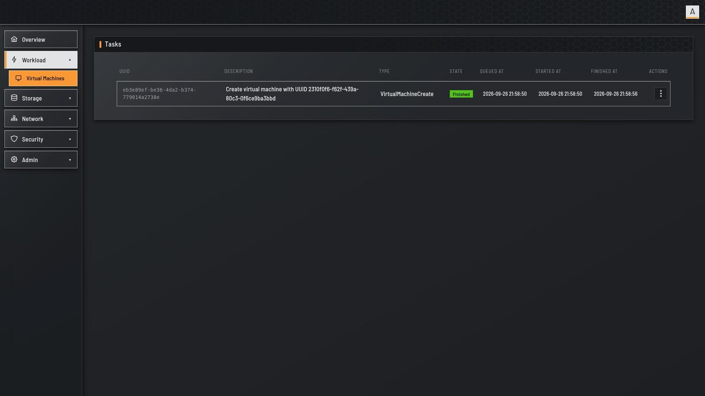

### Network filter

**Show network filter** in the menu of a virtual machine lists the rules of its network filter. A
rule belongs to one direction: **Ingress** filters the traffic towards the virtual machine by its
source, **Egress** the traffic of the virtual machine by its destination. As long as a direction
has no IP range, all addresses are allowed, and as long as it has no port, all ports are allowed.
As soon as it has one, only the listed ones are allowed. Traffic without ports, like ping, is only
checked against the IP ranges.

The **+** button opens a dialog to add new rules. Several IP ranges or ports can be added at once,
separated by commas or spaces. An IP range is a single address, a subnet like `10.0.0.0/24` or a
range like `10.0.0.5-10.0.0.9`, a port a single port like `22` or a range like `8000-8100`.
**Remove** in the menu of a rule deletes it again. The **←** button leads back to the virtual
machines.

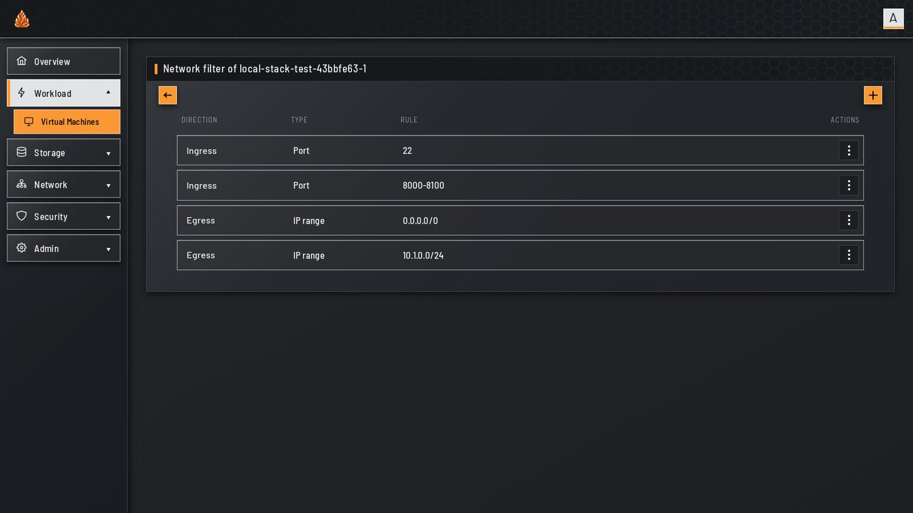

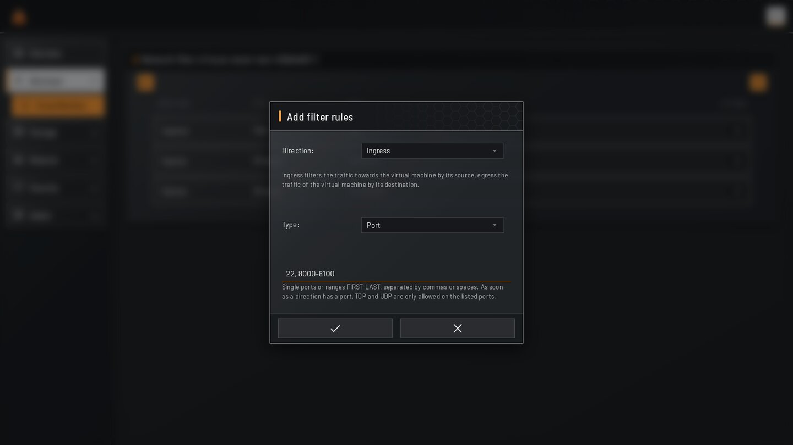

!!! info

    The filter is stateless. If both directions are filtered, the answers of an allowed connection
    have to be allowed in the other direction as well.

### Image

**Storage > Image** lists the images and snapshots. **Info** shows the details of an image and
**Delete** removes it.

### Networks

**Network > Networks** lists the networks with their subnets. **Delete** removes a network.

### Floating IPs

**Network > Floating IPs** lists the floating IPs with the internal IP and the network of the
virtual machine, which they are attached to. **Attach** connects a free floating IP to a virtual
machine, **Detach** releases it again, so it can be attached to another virtual machine, and
**Delete** gives the address back.

### Secrets

**Security > Secrets** lists the secrets. **+** creates a new secret with a name and a payload,
**Show payload** shows its content and **Delete** removes it. For every uploaded image a secret
is created automatically, which is used to encrypt the file of the image, unless an existing secret
was selected at the upload or at the creation of the snapshot.

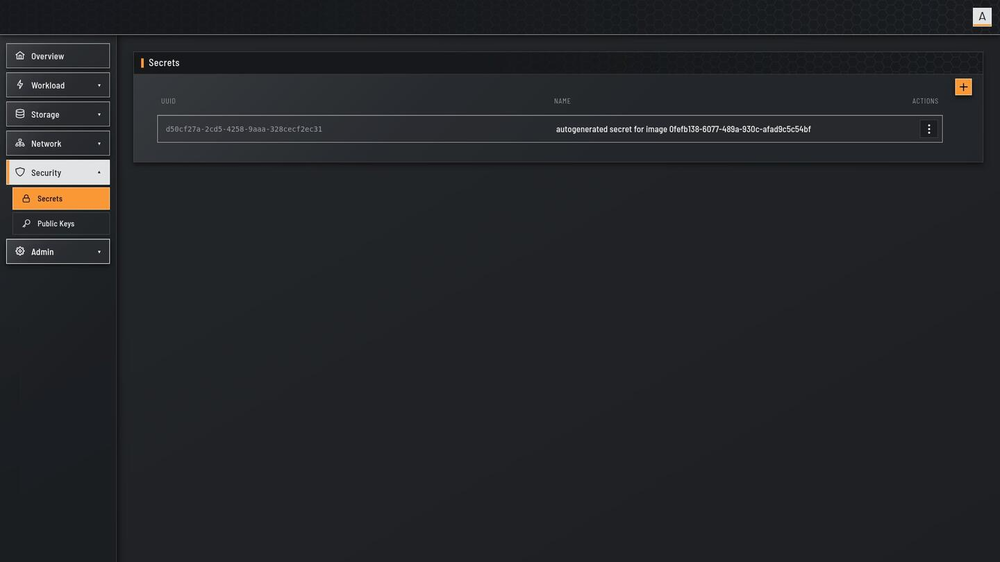

### Public Keys

**Security > Public Keys** lists the public keys with their fingerprints. **Delete** removes a
key. Virtual machines, which were already created with the key, keep it.

### Admin

These pages are only available for admins.

- **User** lists all users. **+** creates a new user with ID, name and passphrase, optional as
    admin. **Info** shows the details of a user and **Delete** removes the user.

    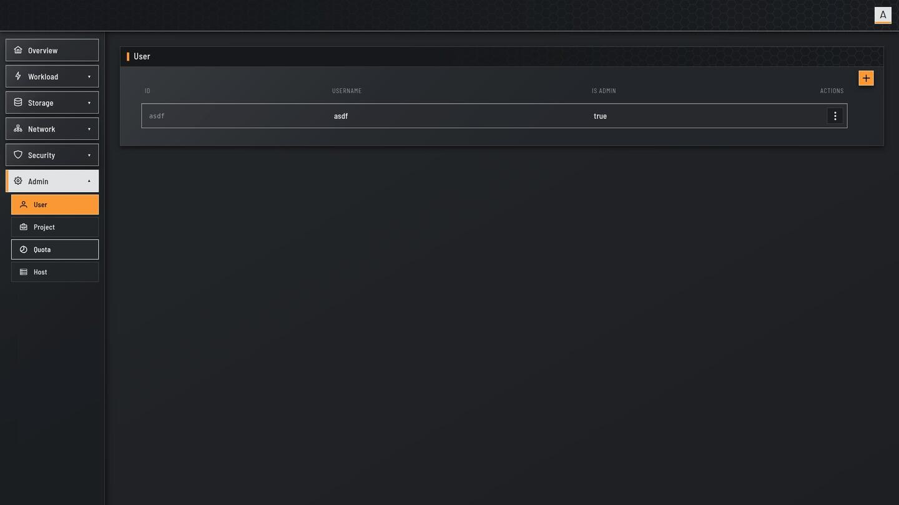

- **Project** lists the projects. **+** creates a new project with ID and name.

    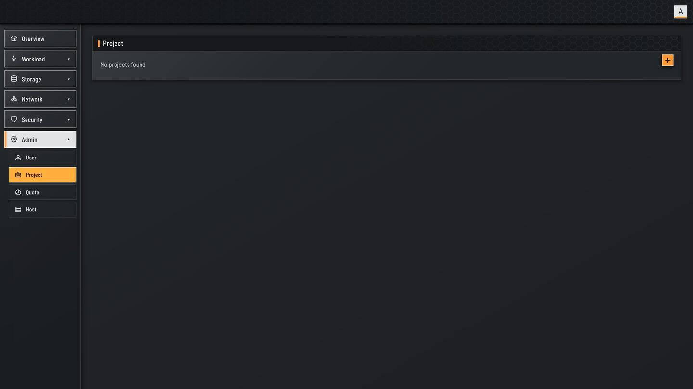

- **Quota** lists the maximum number of resources of each project. **Change Quota** sets new limits.

    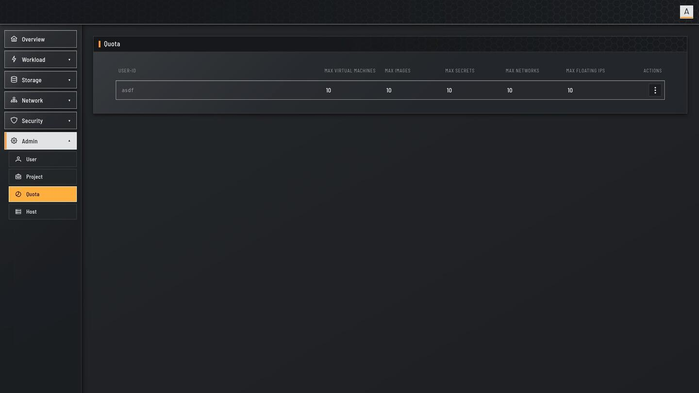

- **VM Types** lists the vm-types with their number of cores and their memory in MiB. **+**
    creates a new vm-type with name, number of cores and memory. **Info** shows the details of a
    vm-type, **Edit** changes its values and **Delete** removes it. Every user can select the
    vm-types, when creating a virtual machine.

    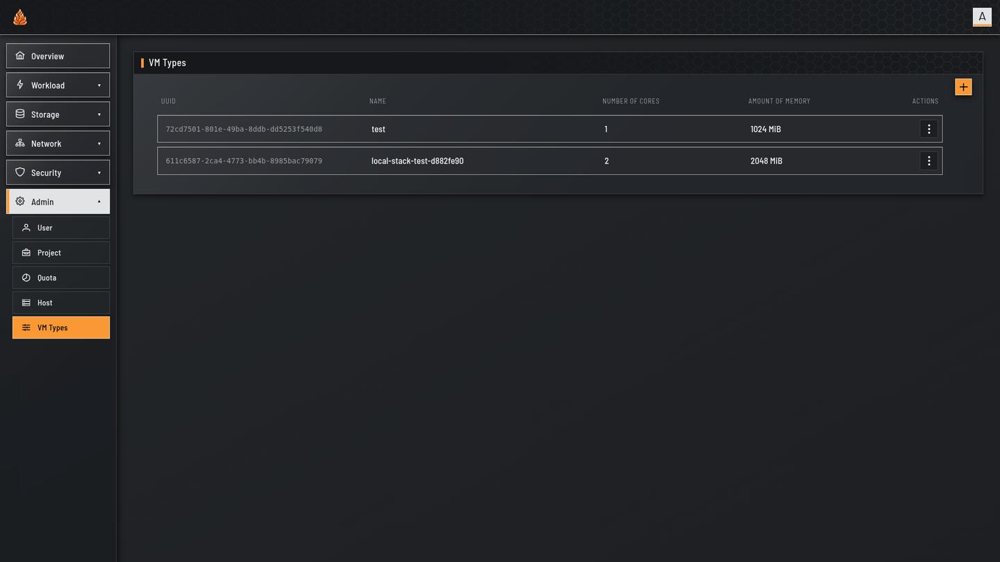

    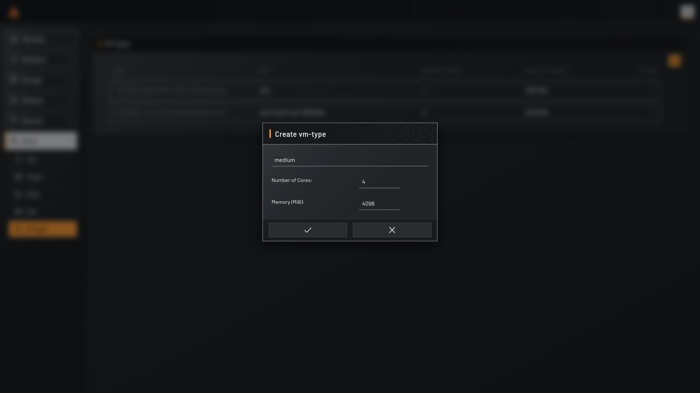

- **Host** lists the hosts with their usage in the tab **SAKURA**, which run the virtual machines,
    and the hosts in the tab **ONSEN**, which store the images. **Delete** removes a host.

    The column **Isolated** shows, if a sakura-host is isolated. An isolated host is only used by
    the virtual machines of a single project, which are created with **Isolated host**. It is
    bound to the project of its first virtual machine and released again, when its last virtual
    machine is deleted. **Set host isolation** changes the flag, which is only possible, while no
    virtual machine runs on the host.

    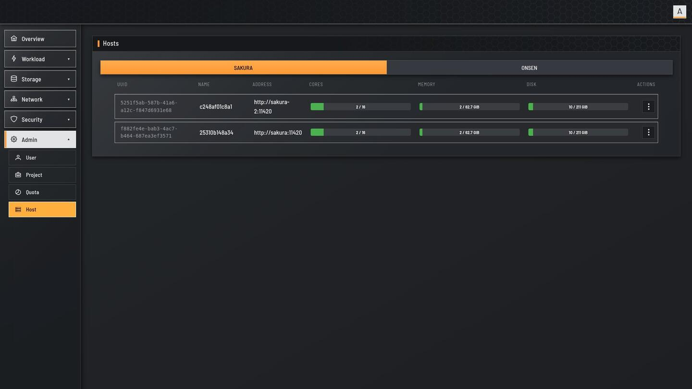

    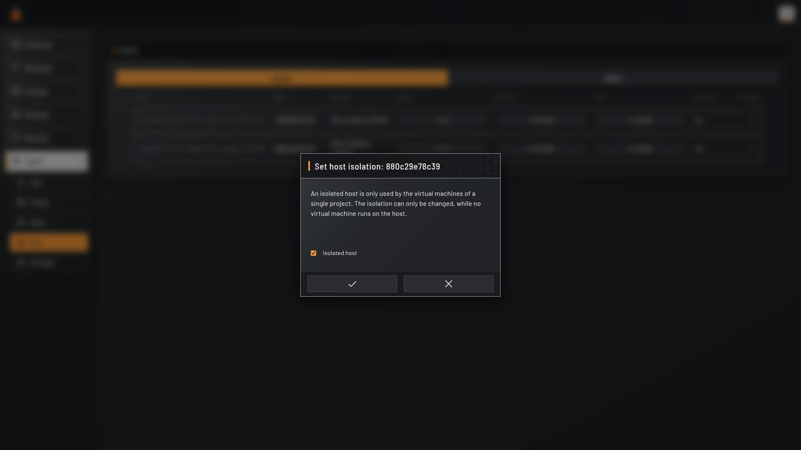
