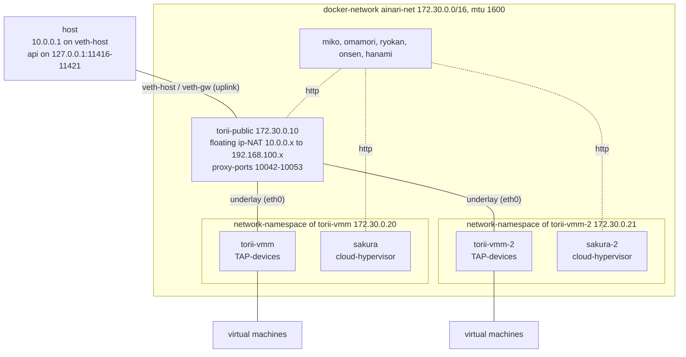
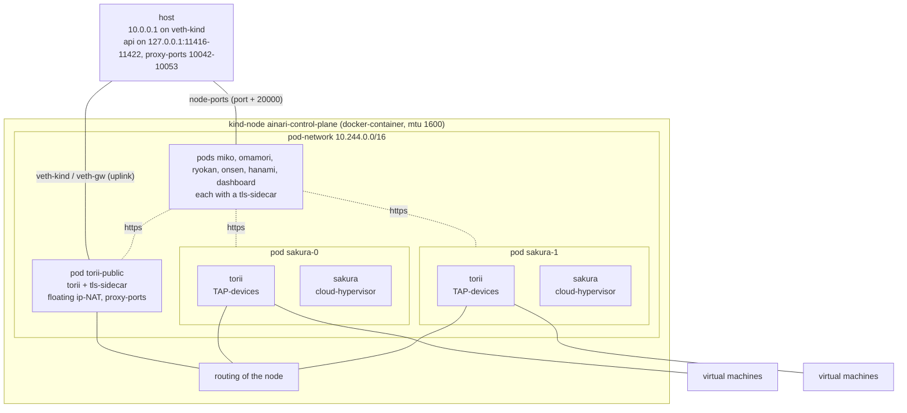
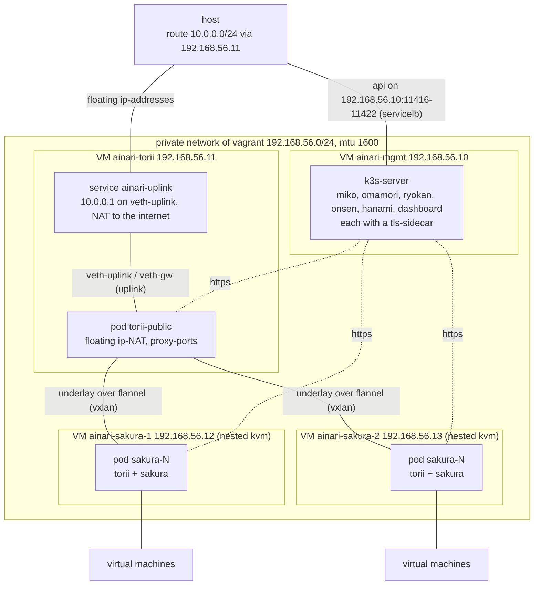

# Local test environments

There are three environments, which run every component of ainari locally. They are meant for
development and testing only. Every one of them is described on its own in the following chapters,
so each chapter can be read without the others:

1. [Docker-compose setup](#1-docker-compose-setup) (`make up local`): all components as
   docker-containers on the host, plain http
2. [Kind setup](#2-kind-setup) (`make up kind`): the helm-chart on a kubernetes-cluster of one
   node in docker, https
3. [Vagrant setup](#3-vagrant-setup) (`make up vagrant`): the helm-chart on a kubernetes-cluster
   of four virtual machines, https
4. [The CA of the kind- and the vagrant-setup](#4-the-ca-of-the-kind--and-the-vagrant-setup):
   how to trust the certificates of the two https-setups
5. [Differences between the setups](#5-differences-between-the-setups)

All of them use the same floating ip-addresses (`10.0.0.0/24`), so only one of them can run at a
time.

---

## 1. Docker-compose setup

### Overview

Runs every component of ainari as a docker-container on the host, defined in `docker-compose.yml`.
There is one gateway at the edge of the network (`torii-public`), which serves the floating
ip-addresses towards the host, and one gateway in front of every sakura-host (`torii-vmm`,
`torii-vmm-2`), which owns the TAP-devices of the virtual machines of that host. There are two
sakura-hosts, so a virtual machine can land on either of them and the traffic between the hosts
really crosses the edge-gateway. The components talk plain http to each other.

### Architecture



Beside the gateways and the sakura-hosts the setup runs `miko` (auth), `omamori` (secrets and
public-keys), `ryokan` (images) with `onsen` (storage) and `hanami` (the api for the virtual
machines). There is no dashboard.

A sakura has no network of its own, because it shares the network-namespace of its gateway. Its
address `http://sakura:11420` (and `http://sakura-2:11420`) is an alias of its gateway in the dns
of docker: the host is listed under its own name, while the address still leads to the
network-namespace, which it shares, and hanami derives the torii of a host from it again.

Hanami picks one of the sakura-hosts for every new virtual machine. Both hosts serve addresses
out of the same subnet of a network: the edge-gateway gets a route towards the host, which really
runs a virtual machine, and the gateway of a host sends everything else to the edge-gateway, so
two virtual machines on different hosts reach each other over it.

### Requirements

- docker with the compose-plugin (`docker compose`)
- `/dev/kvm` and `/dev/net/tun` on the host, because the virtual machines are really booted
- a kernel with eBPF/XDP support, because the gateways attach their datapath to the interfaces
- `sudo`, because the setup-script connects the host to the edge-gateway and adds NAT-rules
- `make`
- `go` in the version of `src/cli/ainarictl/go.mod`, to build the cli
- `python3` with the dependencies of the sdk for the end-to-end test:

    ```bash
    python3 -m venv .venv
    .venv/bin/pip install -r src/sdk/python/ainari_sdk/requirements.txt
    ```

### Usage

1. start the stack. It builds the images first. It needs root, because it creates the veth-pair
   towards the edge-gateway and the NAT-rules for the floating ip-addresses. `docker compose up`
   alone is not enough: `torii-public` waits for that uplink and the host has no route to a
   virtual machine without it.

    ```bash
    make up local    # runs: sudo ./scripts/setup_local_stack.sh
    ```

2. build the cli. The binary is placed beside its sources.

    ```bash
    cd src/cli/ainarictl && go build .
    ```

3. point the cli at the stack and check, that both sakura-hosts are registered. They are listed
   as `http://sakura:11420` and `http://sakura-2:11420`.

    ```bash
    source src/cli/ainarictl/test_auth.sh    # AINARI_ADDRESS, AINARI_USER, AINARI_PASSPHRASE
    ainarictl host list
    ```

4. create a virtual machine. `-j` prints json, so the uuids can be read with `jq`.

    ```bash
    ssh-keygen -t ed25519 -N '' -f ~/.ssh/ainari_local
    ainarictl public_key upload -k ~/.ssh/ainari_local.pub local-key

    wget https://cloud-images.ubuntu.com/noble/current/noble-server-cloudimg-amd64.img
    ainarictl image create disk -i noble-server-cloudimg-amd64.img ubuntu-noble

    ainarictl network create -s 192.168.100.1/24 local-net
    ainarictl vm create -c 2 -m 2147483648 -u NETWORK_UUID -i IMAGE_UUID -k KEY_UUID vm1
    ainarictl vm get VM_UUID                 # repeat, until 'vm_state' is RUNNING
    ainarictl floating_ip add -n vm1-fip -u NETWORK_UUID -i INTERNAL_IP
    ```

5. connect to the virtual machine over its floating ip-address, which the host reaches over
   `veth-host`.

    ```bash
    ssh -i ~/.ssh/ainari_local ubuntu@FLOATING_IP
    ```

   The sakura-host, which got the virtual machine, is reachable at `http://127.0.0.1:TORII_PORT`
   with the proxy-port from the output of `vm create`. Its api requires a token, so `ainarictl`
   is the easier way to ask it.

6. stop the stack again. This also removes the veth-pair and throws all data away.

    ```bash
    make down local    # runs: sudo ./scripts/setup_local_stack.sh --down
    ```

The api is reachable on the host at:

| Component | Address                  |
| --------- | ------------------------ |
| miko      | `http://127.0.0.1:11417` |
| hanami    | `http://127.0.0.1:11418` |
| ryokan    | `http://127.0.0.1:11416` |
| omamori   | `http://127.0.0.1:11421` |
| torii     | `http://127.0.0.1:11419` |

The admin-user is `asdf` with the passphrase `asdfasdf`; both can be overwritten with
`AINARI_USER` and `AINARI_PASSPHRASE` before the setup-script is started.

### End-to-end test

`testing/local_stack/vm_lifecycle_test.py` walks through the whole life-cycle with the python-sdk,
from the ssh-key-pair up to the login into the virtual machines over ssh. It creates two virtual
machines out of the same image, with the same public key and within the same network, and gives
every one of them its own floating ip-address.

```bash
make up local
.venv/bin/python testing/local_stack/vm_lifecycle_test.py
make down local
```

The test waits at its start until both sakura-hosts are registered in hanami.
`AINARI_SAKURA_HOSTS` sets how many hosts it waits for and `AINARI_VIRTUAL_MACHINES` how many
virtual machines it creates. Every one of them gets 2 cores and 2 GiB memory, so the two of the
default need 4 GiB on the host.

### Hints

- **What the setup-script does as root:** it starts the containers with `docker compose`, creates
  the veth-pair `veth-host` / `veth-gw`, gives the host side the address `10.0.0.1/24` and the
  gateway side `10.0.0.254/24`, moves the gateway side into the network-namespace of
  `torii-public`, enables `net.ipv4.ip_forward` and adds a MASQUERADE-rule for `10.0.0.0/24`, so
  the virtual machines reach the internet through the host. The host only ever sees the floating
  ip-addresses; the internal addresses of the virtual machines (`192.168.100.0/24`) stay behind
  the gateway.
- **Privileges:** the three gateways run privileged, because they attach their eBPF-programs to
  the interfaces and create the TAP-devices. The sakura-hosts run as the user `ainari`: the
  hypervisor-binary carries `cap_net_admin+ep` as a file-capability and the containers get
  `CAP_NET_ADMIN` over `cap_add`. `/dev/kvm` is opened through its group, whose id the
  setup-script reads from the device and hands to the containers with `group_add`.
- **State:** every run starts with empty databases; the databases and boot-disks live in the
  containers.
- **Configs:** the configs of the components are in `deploy/local_stack/configs`. The two gateways
  in front of the sakura-hosts share `torii_vmm.toml`; the sakura-hosts need one config each
  (`sakura.toml`, `sakura_2.toml`), because every host registers itself with the address out of
  its own config.
- **Conflicts:** the setup-script refuses to start, if another interface of the host has an
  address in `10.0.0.0/24`, for example the one of the kind-setup. Stop the other setup first.

---

## 2. Kind setup

### Overview

Runs the helm-chart of `deploy/k8s/ainari` on a kubernetes-cluster of one node, which kind
(kubernetes in docker) runs as a docker-container on the host. The values
`deploy/k8s/kind/values.yaml` configure the chart for it. There is one gateway at the edge of the
network (`torii-public`), which serves the floating ip-addresses towards the host, and two
sakura-hosts, each one a pod of the statefulset `sakura` together with the gateway in front of it.
The components only talk https to each other, over a nginx-sidecar with a certificate of
cert-manager. The dashboard is always part of this setup.

### Architecture



The pod-network of kind is routed: every pod has a point-to-point link to the node. The gateways
don't share a link, so torii addresses its encapsulated packets to the router of the node, which
it takes from the route of the kernel, and the node forwards them to the other pod.

Every sakura-host registers itself with the name of its pod in the headless service `sakura`
(`https://sakura-0.sakura.ainari.svc.cluster.local:8443`). Its torii shares the pod, so hanami
derives the torii of a host from this address.

### Requirements

- docker (the engine), which builds the images and runs the kind-node
- `kind`. If it is not installed, `make` downloads the version of `KIND_VERSION` in the
  `Makefile` with `curl` into `temporary_files/bin`.
- `kubectl` and `helm`
- `openssl`, to create the CA of the setup
- `/dev/kvm` and `/dev/net/tun` on the host, because the virtual machines are really booted
- a kernel with eBPF/XDP support, because the gateways attach their datapath to the interfaces
- `sudo`, because the setup-script connects the host to the edge-gateway and adds NAT-rules
- access to github, because cert-manager is installed into the cluster from there
- `make`
- `go` in the version of `src/cli/ainarictl/go.mod`, to build the cli
- `python3` with the dependencies of the sdk for the end-to-end test:

    ```bash
    python3 -m venv .venv
    .venv/bin/pip install -r src/sdk/python/ainari_sdk/requirements.txt
    ```

Docker compose is not required.

### Usage

```bash
make up kind      # runs scripts/setup_kind_stack.sh, asks for sudo for the network-setup
make down kind    # deletes the cluster and removes the veth-pair again
```

`make up kind` builds the images, creates the cluster (`deploy/k8s/kind/cluster.yaml`), installs
cert-manager and the helm-chart and connects the host to the edge-gateway. Every run starts with
empty databases.

The api is reachable on the host at:

| Component | Address                   |
| --------- | ------------------------- |
| miko      | `https://127.0.0.1:11417` |
| hanami    | `https://127.0.0.1:11418` |
| ryokan    | `https://127.0.0.1:11416` |
| omamori   | `https://127.0.0.1:11421` |
| torii     | `https://127.0.0.1:11419` |
| dashboard | `https://127.0.0.1:11422` |

The admin-user is `asdf` with the passphrase `asdfasdf`.

Build the cli in `src/cli/ainarictl` with `go build .` and point it at miko. Without the CA of the
setup in the trust-store of the system (see
[chapter 4](#4-the-ca-of-the-kind--and-the-vagrant-setup)), the cli has to skip the verification of
the certificates:

```bash
export AINARI_ADDRESS=https://127.0.0.1:11417 AINARI_USER=asdf AINARI_PASSPHRASE=asdfasdf
ainarictl --insecure host list
```

A virtual machine is created like this:

```bash
ssh-keygen -t ed25519 -N '' -f ~/.ssh/ainari_local
ainarictl --insecure public_key upload -k ~/.ssh/ainari_local.pub local-key

wget https://cloud-images.ubuntu.com/noble/current/noble-server-cloudimg-amd64.img
ainarictl --insecure image create disk -i noble-server-cloudimg-amd64.img ubuntu-noble

ainarictl --insecure network create -s 192.168.100.1/24 local-net
ainarictl --insecure vm create -c 2 -m 2147483648 -u NETWORK_UUID -i IMAGE_UUID -k KEY_UUID vm1
ainarictl --insecure vm get VM_UUID      # repeat, until 'vm_state' is RUNNING
ainarictl --insecure floating_ip add -n vm1-fip -u NETWORK_UUID -i INTERNAL_IP

ssh -i ~/.ssh/ainari_local ubuntu@FLOATING_IP
```

The cluster can be inspected with:

```bash
kubectl --context kind-ainari --namespace ainari get pods
```

### End-to-end test

`testing/local_stack/vm_lifecycle_test.py` walks through the whole life-cycle with the python-sdk,
from the ssh-key-pair up to the login into the virtual machines over ssh. It skips the
verification of the certificates.

```bash
make up kind
AINARI_MIKO_ADDRESS=https://127.0.0.1:11417 .venv/bin/python testing/local_stack/vm_lifecycle_test.py
make down kind
```

`AINARI_SAKURA_HOSTS` sets how many sakura-hosts the test waits for (default 2) and
`AINARI_VIRTUAL_MACHINES` how many virtual machines it creates (default 2, each with 2 cores and
2 GiB memory).

### Hints

- **Certificates:** all certificates are signed by the CA `temporary_files/kind/ainari-kind-ca.crt`.
  Without it in the trust-stores, the clients have to skip the verification and the dashboard
  can't log in. How to trust it is described in
  [chapter 4](#4-the-ca-of-the-kind--and-the-vagrant-setup).
- **What the setup-script does as root:** it creates the veth-pair `veth-kind` / `veth-gw`, gives
  the host side `10.0.0.1/24`, moves the gateway side over the network-namespace of the node into
  the one of the pod `torii-public`, enables `net.ipv4.ip_forward` and adds a MASQUERADE-rule for
  `10.0.0.0/24`.
- **Ports:** the api and the proxy-ports are published as node-ports (port + 20000, see
  `global.external_services` in the values) and mapped back to their original ports on
  `127.0.0.1` by the `extraPortMappings` of `deploy/k8s/kind/cluster.yaml`.
- **kvm:** the kind-node creates its own `/dev/kvm`, so sakura gets the kvm-group of the node, not
  the one of the host. The setup-script reads it from the node.
- **grpc:** the connection between ryokan, sakura and onsen is still plain grpc, because the
  grpc-client has no tls-support yet.
- **Conflicts:** the setup-script refuses to start, if another interface of the host has an
  address in `10.0.0.0/24`, for example the one of the docker-compose setup. Stop the other setup
  first.

---

## 3. Vagrant setup

### Overview

Runs the helm-chart of `deploy/k8s/ainari` on a kubernetes-cluster (k3s) of four virtual machines,
which vagrant creates with libvirt (`testing/vagrant/Vagrantfile`). An ansible-playbook
(`testing/vagrant/playbook.yaml`) installs k3s, cert-manager and the chart with the values of
`testing/vagrant/values.yaml`. Every component runs only on the virtual machines with its label,
so the traffic between the sakura-hosts and the edge-gateway really crosses the network between
the virtual machines. The sakura-hosts get nested virtualization, so they boot the virtual
machines of ainari within their own virtual machine. The components only talk https to each
other, over a nginx-sidecar with a certificate of cert-manager. The dashboard is always part of
this setup.

| Virtual machine   | Address         | Runs                                                               |
| ----------------- | --------------- | ------------------------------------------------------------------ |
| `ainari-mgmt`     | `192.168.56.10` | the k3s-server, miko, hanami, ryokan, onsen, omamori, the dashboard |
| `ainari-torii`    | `192.168.56.11` | `torii-public`, the gateway at the edge of the network              |
| `ainari-sakura-1` | `192.168.56.12` | one sakura-host with the torii in front of it                       |
| `ainari-sakura-2` | `192.168.56.13` | the other sakura-host with the torii in front of it                 |

### Architecture



The service `ainari-uplink` on the virtual machine `ainari-torii` moves a veth-pair into the pod
of `torii-public` and a new one into every new pod of it. That virtual machine is the next hop
`10.0.0.1` of the gateway, routes the floating ip-addresses between the gateway and the host and
masquerades the traffic of the virtual machines of ainari towards the internet.

The overlay of torii runs within the vxlan of flannel, which adds a second header. The private
network therefore has an mtu of 1600, so the pods get 1550 and the virtual machines of ainari keep
the full mtu of 1500.

Every sakura-host registers itself with the name of its pod in the headless service `sakura`
(`https://sakura-0.sakura.ainari.svc.cluster.local:8443`). Its torii shares the pod, so hanami
derives the torii of a host from this address.

### Requirements

- `vagrant` with the plugin `vagrant-libvirt` and libvirt. The installation is described in
  `docs/developer/repo/local_testing.md`.
- nested virtualization of kvm: `/sys/module/kvm_amd/parameters/nested` or
  `/sys/module/kvm_intel/parameters/nested` has to be `1` or `Y`
- about 20 GiB free memory and 25 GiB free disk
- docker (the engine), which builds the images
- `openssl`, to create the CA of the setup
- `ansible-playbook`. If it is not installed, `make` installs `ansible-core` into a virtual
  environment in `temporary_files/ansible-venv`.
- `sudo`, because the setup-script adds a route towards the floating ip-addresses on the host
- access to the internet from the virtual machines, because they install k3s, helm and
  cert-manager from there
- `make`
- `go` in the version of `src/cli/ainarictl/go.mod`, to build the cli
- `python3` with the dependencies of the sdk for the end-to-end test:

    ```bash
    python3 -m venv .venv
    .venv/bin/pip install -r src/sdk/python/ainari_sdk/requirements.txt
    ```

Neither docker compose, nor kind, `kubectl` or `helm` are required on the host, and the kernel of
the host needs no eBPF-support, because the gateways run within the virtual machines.

### Usage

```bash
make up vagrant      # runs scripts/setup_vagrant_stack.sh, asks for sudo for the route
make down vagrant    # destroys the virtual machines and removes the route again
```

`make up vagrant` builds the images, starts the four virtual machines, runs the ansible-playbook
over them and at last adds the route `10.0.0.0/24 via 192.168.56.11` on the host. Every run starts
with empty databases, also when the virtual machines already exist; a run over existing virtual
machines only skips their creation and the installation of k3s.

The api is reachable on the host at:

| Component | Address                       |
| --------- | ----------------------------- |
| miko      | `https://192.168.56.10:11417` |
| hanami    | `https://192.168.56.10:11418` |
| ryokan    | `https://192.168.56.10:11416` |
| omamori   | `https://192.168.56.10:11421` |
| torii     | `https://192.168.56.11:11419` |
| dashboard | `https://192.168.56.10:11422` |

The admin-user is `asdf` with the passphrase `asdfasdf`.

Build the cli in `src/cli/ainarictl` with `go build .` and point it at miko. Without the CA of the
setup in the trust-store of the system (see
[chapter 4](#4-the-ca-of-the-kind--and-the-vagrant-setup)), the cli has to skip the verification of
the certificates:

```bash
export AINARI_ADDRESS=https://192.168.56.10:11417 AINARI_USER=asdf AINARI_PASSPHRASE=asdfasdf
ainarictl --insecure host list
```

A virtual machine is created like this:

```bash
ssh-keygen -t ed25519 -N '' -f ~/.ssh/ainari_local
ainarictl --insecure public_key upload -k ~/.ssh/ainari_local.pub local-key

wget https://cloud-images.ubuntu.com/noble/current/noble-server-cloudimg-amd64.img
ainarictl --insecure image create disk -i noble-server-cloudimg-amd64.img ubuntu-noble

ainarictl --insecure network create -s 192.168.100.1/24 local-net
ainarictl --insecure vm create -c 2 -m 2147483648 -u NETWORK_UUID -i IMAGE_UUID -k KEY_UUID vm1
ainarictl --insecure vm get VM_UUID      # repeat, until 'vm_state' is RUNNING
ainarictl --insecure floating_ip add -n vm1-fip -u NETWORK_UUID -i INTERNAL_IP

ssh -i ~/.ssh/ainari_local ubuntu@FLOATING_IP
```

The cluster and the virtual machines can be inspected with:

```bash
kubectl --kubeconfig temporary_files/vagrant/kubeconfig --namespace ainari get pods -o wide
cd testing/vagrant && vagrant ssh ainari-mgmt    # kubectl and helm work there as well
```

### End-to-end test

`testing/local_stack/vm_lifecycle_test.py` walks through the whole life-cycle with the python-sdk,
from the ssh-key-pair up to the login into the virtual machines over ssh. It skips the
verification of the certificates.

```bash
make up vagrant
AINARI_MIKO_ADDRESS=https://192.168.56.10:11417 .venv/bin/python testing/local_stack/vm_lifecycle_test.py
make down vagrant
```

`AINARI_SAKURA_HOSTS` sets how many sakura-hosts the test waits for (default 2) and
`AINARI_VIRTUAL_MACHINES` how many virtual machines it creates (default 2, each with 2 cores and
2 GiB memory within the virtual machines of the sakura-hosts, which have 6 GiB each).

### Hints

- **Certificates:** all certificates are signed by the CA
  `temporary_files/vagrant/ainari-vagrant-ca.crt`. Without it in the trust-stores, the clients have
  to skip the verification and the dashboard can't log in. How to trust it is described in
  [chapter 4](#4-the-ca-of-the-kind--and-the-vagrant-setup).
- **Ports:** the servicelb of k3s publishes the api and the proxy-ports of torii with their own
  ports on every virtual machine (`global.external_services` with the type `LoadBalancer` in the
  values), so every address of the virtual machines works, not only the ones in the table.
- **Provisioning again:** after a change of the chart or the playbook, `make up vagrant` updates
  the running virtual machines. Ansible alone can be started again with
  `cd testing/vagrant && vagrant provision ainari-sakura-2`; it is attached to the last virtual
  machine and runs over all of them.
- **Uplink:** `vagrant ssh ainari-torii -c 'sudo journalctl -u ainari-uplink'` shows, when the
  uplink was moved into a pod of `torii-public`.
- **grpc:** the connection between ryokan, sakura and onsen is still plain grpc, because the
  grpc-client has no tls-support yet.
- **Conflicts:** the setup-script refuses to start, if an interface of the host has an address in
  `10.0.0.0/24`, for example the one of the docker-compose or the kind-setup. Stop the other
  setup first.

---

## 4. The CA of the kind- and the vagrant-setup

The kind- and the vagrant-setup serve every endpoint over https. All certificates of a setup are
signed by its own CA, which `make up kind` or `make up vagrant` creates once and keeps over all
runs, so it only has to be trusted once. Trusted, the browser and the clients accept all endpoints
of the setup, also the proxy-ports of torii, without any exceptions. Without it, the clients have
to skip the verification (`ainarictl --insecure`), and the dashboard can't log in, even if its own
certificate was accepted in the browser: the browser talks to the api on other ports, whose
certificates would have to be accepted separately.

| Setup   | CA                                             | Name                | Valid only for                                  |
| ------- | ---------------------------------------------- | ------------------- | ----------------------------------------------- |
| kind    | `temporary_files/kind/ainari-kind-ca.crt`       | `ainari-kind-ca`    | `127.0.0.1`, `localhost`, names below `cluster.local` |
| vagrant | `temporary_files/vagrant/ainari-vagrant-ca.crt` | `ainari-vagrant-ca` | `192.168.56.0/24`, names below `cluster.local`   |

The CAs are limited by name-constraints to the addresses of their setup, so they can't be misused
for any other host, even if their key leaks. Deleting `temporary_files/kind` or
`temporary_files/vagrant` creates a new CA with the next start of the setup, which then has to be
trusted again.

The commands below are the same for both setups. They are run in the root of the repository with
the name of the setup in `SETUP`:

```bash
SETUP=kind       # or: SETUP=vagrant
```

### Trust-store of the system

The trust-store of the system (debian/ubuntu) is used by curl and the go-cli, so `ainarictl` works
without `--insecure`. The file has to end with `.crt` and has to be in
`/usr/local/share/ca-certificates`, otherwise it is skipped. `update-ca-certificates` reports
`1 added`:

```bash
sudo cp temporary_files/$SETUP/ainari-$SETUP-ca.crt /usr/local/share/ca-certificates/ainari-$SETUP-ca.crt && sudo update-ca-certificates
```

While the setup is running, the api then answers without skipping the verification, for example
`curl https://127.0.0.1:11417/v1alpha/is_ready` (kind) or
`curl https://192.168.56.10:11417/v1alpha/is_ready` (vagrant). To remove the CA again:

```bash
sudo rm /usr/local/share/ca-certificates/ainari-$SETUP-ca.crt && sudo update-ca-certificates --fresh
```

### Firefox

Firefox and Chromium don't use the trust-store of the system on linux, but their own
nss-databases, so the CA has to be added to them separately, even if it is already in the one of
the system.

An enterprise-policy imports the CAs at every start into every profile of Firefox. It uses the
files of the trust-store of the system, so that step has to be done first. The command overwrites
an existing `/etc/firefox/policies/policies.json`, so check before, that there is none yet.

```bash
sudo mkdir -p /etc/firefox/policies && echo '{"policies":{"Certificates":{"Install":["/usr/local/share/ca-certificates/ainari-'$SETUP'-ca.crt"]}}}' | sudo tee /etc/firefox/policies/policies.json
```

To trust the CAs of both setups, both files have to be in the trust-store of the system and both
paths in the list:

```bash
sudo mkdir -p /etc/firefox/policies && echo '{"policies":{"Certificates":{"Install":["/usr/local/share/ca-certificates/ainari-kind-ca.crt","/usr/local/share/ca-certificates/ainari-vagrant-ca.crt"]}}}' | sudo tee /etc/firefox/policies/policies.json
```

Firefox has to be closed completely and started again afterwards; `about:policies` shows the
policy as active. Without the policy, the CA can be imported by hand: *Settings → Privacy &
Security → Certificates → View Certificates → Authorities → Import*, then choose *Trust this CA to
identify websites*. To remove the policy again: `sudo rm /etc/firefox/policies/policies.json`; the
CAs, which Firefox imported already, stay in its store, until they are deleted under
*Authorities*.

### Chrome and Chromium

Chrome and Chromium use the nss-database of the user in `~/.pki/nssdb` (the snap of Chromium uses
`~/snap/chromium/current/.pki/nssdb` instead). `certutil` is part of `libnss3-tools`:

```bash
sudo apt install libnss3-tools
certutil -d sql:$HOME/.pki/nssdb -A -t "C,," -n ainari-$SETUP-ca -i temporary_files/$SETUP/ainari-$SETUP-ca.crt
```

The browser has to be restarted completely afterwards; `certutil -d sql:$HOME/.pki/nssdb -L`
lists the CA as `ainari-kind-ca` or `ainari-vagrant-ca` with the trust `C,,`. Without `certutil`,
the CA can be imported by hand in *Settings → Privacy and security → Security → Manage
certificates* under the authorities, with *Trust this certificate for identifying websites*. To
remove it again:

```bash
certutil -d sql:$HOME/.pki/nssdb -D -n ainari-$SETUP-ca
```

### Python-sdk

The python-sdk uses the certificates of `certifi` and not the ones of the system, so it needs the
CA explicitly:

```bash
export REQUESTS_CA_BUNDLE=temporary_files/$SETUP/ainari-$SETUP-ca.crt
```

The end-to-end test `testing/local_stack/vm_lifecycle_test.py` skips the verification anyway.

---

## 5. Differences between the setups

|                                     | Docker-compose setup                  | Kind setup                                      | Vagrant setup                                           |
| ----------------------------------- | ------------------------------------- | ----------------------------------------------- | ------------------------------------------------------- |
| Start / stop                        | `make up local` / `make down local`   | `make up kind` / `make down kind`               | `make up vagrant` / `make down vagrant`                 |
| Setup-script                        | `scripts/setup_local_stack.sh`        | `scripts/setup_kind_stack.sh`                   | `scripts/setup_vagrant_stack.sh`                        |
| Deployment                          | `docker-compose.yml`                  | helm-chart `deploy/k8s/ainari`                  | helm-chart `deploy/k8s/ainari`                          |
| Configuration                       | `deploy/local_stack/configs`          | `deploy/k8s/kind/values.yaml`                   | `testing/vagrant/values.yaml`                           |
| Runs on                             | docker-containers on the host         | one kubernetes-node in docker (kind)            | four virtual machines with k3s (vagrant, libvirt)       |
| Nodes                               | none                                  | 1                                               | 4 (management, edge-gateway, 2 sakura-hosts)            |
| Placement of the components         | all on the host                       | all on the one node                             | on the virtual machines with their label                |
| Protocol of the api                 | http                                  | https                                           | https                                                   |
| Certificates                        | none                                  | own CA, `temporary_files/kind`                  | own CA, `temporary_files/vagrant`                       |
| Address of the api                  | `http://127.0.0.1:<port>`             | `https://127.0.0.1:<port>`                      | `https://192.168.56.10:<port>`, torii on `.11`          |
| Dashboard                           | no                                    | yes, port 11422                                 | yes, port 11422                                         |
| Network between the gateways        | one docker-bridge (shared link)       | routed pod-network of kind                      | flannel (vxlan) between the virtual machines            |
| Uplink of the edge-gateway          | `veth-host` on the host               | `veth-kind` on the host                         | `veth-uplink` on the virtual machine `ainari-torii`     |
| Reaching the floating ip-addresses  | directly over `veth-host`             | directly over `veth-kind`                       | over the route `10.0.0.0/24 via 192.168.56.11`          |
| NAT of the virtual machines         | on the host                           | on the host                                     | on the virtual machine `ainari-torii`                   |
| Virtualization of the sakura-hosts  | kvm of the host                       | kvm of the host                                 | nested kvm within the virtual machines                  |
| Needs sudo for                      | the whole setup-script                | the veth-pair and the NAT-rules                 | only the route on the host                              |
| Tools on the host                   | docker compose                        | kind, kubectl, helm, openssl                    | vagrant-libvirt, ansible, openssl                       |
| eBPF-support of the host-kernel     | required                              | required                                        | not required                                            |
| Resources                           | smallest                              | small                                           | about 20 GiB memory, 25 GiB disk                        |
| Time to start                       | fast                                  | a few minutes                                   | longest (virtual machines, k3s)                         |
| Suited for                          | fast development of the components    | testing the helm-chart                          | testing a real multi-node deployment                    |
